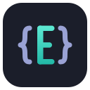

# Editora

[](https://github.com/adriandeleon/Editora/actions/workflows/ci.yml)
[](LICENSE)


[](https://github.com/adriandeleon/Editora/stargazers)

<!-- Uncomment after the first vX.Y.Z release tag:
[](https://github.com/adriandeleon/Editora/releases/latest)
[](https://github.com/adriandeleon/Editora/releases)
[](https://github.com/adriandeleon/Editora/actions/workflows/release.yml)
-->


A keyboard-driven, cross-platform programmer's text editor built with **JDK 25**,
**JavaFX 25**, [**RichTextFX**](https://github.com/FXMisc/RichTextFX) and **Maven**. Every action is a registered command, reachable by an
Emacs-style keymap or a fuzzy command palette.

## Contents

- [Features](#features)
- [Requirements](#requirements)
- [Build & Run](#build--run)
- [Releases](#releases)
- [Command line](#command-line)
- [Configuration](#configuration)
- [License](#license)

## Features

- **Command-driven core** — every action is a `Command`; bind it to a chord or run it
  from the M-x command palette.
- **Keyboard "Jump to…" popups** — fuzzy pickers for recent files (`C-x C-r`), the active file's
  structure/symbols (`M-g i`), open files/tabs (`C-x b`), and tool windows (`M-g t`) — keyboard-first
  alternatives to their list/tool-window UIs.
- **Keyboard file finder** (`C-x C-f`) — Emacs `find-file`-style path popup with prefix
  autocomplete; type/`Tab` to complete, Enter to descend folders or open (or create) a file. The
  Open toolbar icon still uses the native OS dialog.
- **Projects** (off by default; enable in Settings) — VSCode single-folder-workspace style: a root
  folder + its own saved session (open files, layout, folds), shown as a filterable file tree in the
  Project tool window with a project switcher in the toolbar. Open (`C-x C-p`)/switch (`C-x p`)/close
  via the palette or toolbar; switching restores that project's files and layout.
- **Emacs-style keymap** — multi-key chord sequences (e.g. `C-x C-s`), with user overrides.
  (On macOS, the Option dead keys `Option`+`e`/`i`/`u`/`n`/`` ` `` are intercepted by the OS for
  accent composition, so a few `M-`-chords like `M-e` aren't reachable by keyboard there — the
  command palette still works.)
- **Syntax highlighting** — TextMate grammars (via [tm4e](https://github.com/eclipse/tm4e)) for 30+
  languages: Java, TypeScript/JavaScript, XML, shell, PowerShell, DOS batch, Python, Groovy, Kotlin,
  Ruby, PHP, C, C++, Rust, Go, C#, Lua, Markdown, JSON, CSS, HTML, YAML, INI, TOML, SQL, Dockerfile,
  Terraform/HCL, Mermaid, and `.http`.
- **Bundled fonts** — JetBrains Mono (default), Cascadia Code, Fira Code, IBM Plex Mono,
  and Source Code Pro ship with the app; no system install required.
- **Editor view options** — 80-column ruler and current-line highlight.
- **Auto / smart indentation** — Enter keeps the indentation and adds a level after a block opener
  (per language: braces, `:` for Python/YAML, `do`/`then` for shell, `def`/`class`/`do` for Ruby, open
  tags for XML/HTML); Enter between a matching pair opens an indented stanza; typing a closing
  bracket/keyword re-aligns the line. Indent unit (tab vs spaces) is inferred from the file.
- **Auto-close & matching brackets** — typing `([{`/quotes inserts the matching closer (type over it to
  skip, wrap a selection by typing a bracket/quote around it, Backspace clears an empty pair); the
  bracket matching the one next to the caret is highlighted.
- **Comment / uncomment** (`M-;`) — toggles a line comment for a single line and a block/region comment
  for a multi-line selection, using the language's comment syntax (`//`, `#`, `<!-- -->`, `/* */`, `--`, …).
- **Multiple cursors & column selection** — VS Code–style multi-caret editing: add a caret at the next
  occurrence of the selection / above / below, type or edit everywhere at once, `Esc` to collapse; plus
  Alt-drag column/box selection. (Powered by a personal RichTextFX fork.)
- **Spell checking** — red wavy underlines on misspelled words, with right-click suggestions,
  Add-to-Dictionary, and Ignore. Source files only check comments and string literals; plaintext and
  Markdown are checked in full. Toggle via "View: Toggle Spell Check"; choose a dictionary per file
  ("Spell Check: Set Language…", ships English en_US/en_GB, Spanish, and French). Pure-Java (Apache
  Lucene Hunspell).
- **Code intelligence (LSP)** — language smarts via the Language Server Protocol, with **21 servers**
  auto-detected on `PATH` (Java/JDT LS, TypeScript/JavaScript, Python/Pyright, Go, Rust, C/C++/clangd,
  C#, PHP, Ruby, Kotlin, Lua, Bash, XML, JSON, YAML, HTML, CSS, Dockerfile, SQL, Terraform, TOML).
  Inline diagnostics + a Problems tool window (`M-8`) + minimap/scrollbar stripes, go-to-definition
  (`M-.`), find references (`M-?`), hover docs (`C-c h`), LSP-backed completion, and auto-imports.
  Off by default; per-server command + enable in *Settings → LSP*.
- **Search** — incremental find bar (`C-s`/`C-r`) with regex, case, and whole-word toggles, a match
  count, and live highlight-all; **Find in Files** (`C-S-f`) across the project + open buffers with
  replace-in-files and a results tool window (`M-6`); and **AceJump** (`M-g j`) — type a character, then
  a label, to fly the caret to any on-screen occurrence.
- **Run a file from a gutter ▶** — a green play glyph runs a Java 25 compact-source file
  (`java <file>`), a Python script (`python3`), or a shell script (`bash`); output streams into a Run
  tool window (`M-9`) with clickable stack traces, stdin, and per-file program arguments. Gated by the
  LSP feature.
- **Debugging (DAP)** — a full debugger for **Java**, **Python** (debugpy), and **JavaScript/Node**
  (vscode-js-debug): breakpoints (conditional / logpoints), step / resume / pause / run-to-cursor /
  jump-to-line, call stack, variables, watches and set-value, inline values and a value-hover popup, and
  an IntelliJ-style Debug tool window (`M-g d`). Off by default (*Settings → Debugging*); adapters are
  user-installed (helper scripts provided).
- **Read-only / View mode** — toggle a buffer read-only (`C-x C-q` or the palette) to view without
  editing; typing and edit commands are blocked while everything else keeps working. Files that aren't
  writable on disk open read-only automatically, and the per-file state is remembered across restarts.
  A Word-style "View Mode" banner docks above the editor with an **Enable Editing** button (when the
  file is writable). While read-only, Space pages down and Backspace pages up (pager-style).
- **Simple UI mode** — a single toggle (toolbar icon, **View: Toggle Simple UI Mode** in the palette,
  *Settings → Application*, or the `--simple` launch flag) that strips the window to a minimal editing
  surface: it hides the extra toolbar groups (new-from-template, recent, find-in-files, split, project
  selector), the tool-window stripe, the breadcrumb,
  the entire gutter (line numbers + fold chevrons + markers; collapsed regions are unfolded first), the
  minimap, and most status-bar segments (git, LSP, language, tab size, line endings, encoding), while
  keeping the tabs, the essential toolbar icons (including **Open**), and the file-size segment. It also **disables the heavier features** — language
  servers (LSP), debugging, the HTTP client, Git, and multiple cursors / column selection — for a quiet
  plain editor. Persists across restarts; your saved preferences (line numbers, minimap, breadcrumb, tool
  stripe, LSP/debug/HTTP/Git and multi-caret enables) are all restored when you turn it off.
- **Text zoom** — scale the editor text on top of the font size (status-bar `− 100% +`, `C-=`/`C--`/`C-0`,
  Ctrl+mouse-wheel, or the palette); persists across restarts, separate from the font-size setting.
- **Themes** — switchable AtlantaFX themes (Primer, Nord, Cupertino, Dracula), each
  with a matching editor color theme (syntax + surface) that follows the app theme by
  default and is independently selectable in Settings.
- **Markdown preview** — IntelliJ-style 3-mode view (Editor / Editor + Preview / Preview) via a
  floating control top-right of the editor, rendered natively (CommonMark + GFM: tables, task lists,
  strikethrough, autolinks) with **GitHub-style** output — task-list checkboxes, inline-code pills,
  underlined h1/h2, and **images** (local and remote). Live-updating and theme-matched; the mode is
  remembered per file. Zoom the preview text with its `−`/`+` control or, in Preview mode,
  **Ctrl + mouse wheel**.
- **Mermaid diagrams** — render Mermaid in the preview (standalone `.mmd` files and ` ```mermaid `
  fenced blocks inside Markdown), export a diagram to **SVG / PNG / PDF**, get live `maid` linting with
  inline error squiggles, and keyword + snippet autocomplete in `.mmd` files. Uses the external
  **mmdc** (mermaid-cli) to render/export and **maid** to lint (configure their commands in Settings).
  **Off by default** — enable under *Settings → Mermaid*.
- **Export to PDF** — export the active file as a real, *searchable* PDF: source code with syntax
  highlighting and optional line numbers (always a light theme), the **Markdown** preview as native
  vector text (headings, lists, tables, images, embedded diagrams), or a standalone Mermaid `.mmd`
  diagram. Run "File: Export to PDF" / "File: Export Preview to PDF" from the palette; choose line
  numbers, syntax highlighting, and page size (Letter / A4) under *Settings → Editor → PDF Export*.
- **Print** — native printing of code or the rendered Markdown preview, with a print-preview window
  first (always light, what-you-preview-is-what-prints), reusing the PDF layout core. Run "File: Print"
  / "File: Print Preview" from the palette.
- **Snippets** — VS Code / TextMate-style templates with interactive tab stops. Type a prefix + Tab to
  expand (or pick via `C-c i` / "Snippet: Insert…"); Tab/Shift-Tab cycle fields, placeholders are
  pre-selected, mirrors update live, `$0` is the final caret. Standard body syntax (`$1`,
  `${1:default}`, mirrors, choices, variables, escapes). Snippets ship for all 21 highlighted languages
  (most from the MIT [friendly-snippets](https://github.com/rafamadriz/friendly-snippets) collection);
  add your own in `~/.editora/snippets/<language>.json` (user snippets override bundled).
- **File templates** — "New File From Template" (`C-c C-n`) creates a file (or a whole set of files) from
  a reusable template, prompting for any `${variables}` in a wizard and placing the caret at `${cursor}`.
  Bundled templates (Java class, HTML page / multi-file bundle, Markdown doc, Python script) plus your
  own in `~/.editora/templates/`.
- **Autocomplete** — appears as you type (and on demand via `C-M-i` / `M-/`). In **code**, a popup of
  **snippet** completions (accepting expands the snippet with its tab stops; Enter/Tab accept, arrows
  navigate). In **prose** (plain text / Markdown), inline **"ghost text"** — a single greyed
  continuation after the caret from the spell dictionary + your personal dictionary; **Tab** accepts.
  Settings → Editor has a master toggle plus per-source checkboxes (words/prose, snippets).
- **Welcome page** — a VSCode-style start panel (New File / Open File / recent files) shown in the editor
  area when no files are open, instead of a blank Untitled buffer; `--new-file[=name]` opens a fresh buffer
  instead.
- **Recent files** — persistent most-recently-used list.
- **Bookmarks** — toggle line bookmarks (`C-c m`) with a gutter marker and optional notes; the
  Bookmarks tool window lists them across all files, `C-c ]`/`C-c [` cycle within a file, and `M-g b`
  is a cross-file jump picker. Reorder bookmarks (and file groups) in the tool window with Alt+Up/Down,
  the right-click menu, or drag-and-drop — the jump picker follows the same order. Saved in
  `bookmarks.json`, scoped per project (switching projects shows that project's bookmarks; deleting a
  project deletes its bookmarks).
- **Personal Notes** — private annotations attached to a file *without modifying the file* (ideal for
  read-only, generated, or shared code). Add a note on a word, line, or selection range
  (`C-c n`, the editor right-click menu, or the gutter glyph); give it a body, tags, and a status
  (active / resolved / orphaned). Notes follow their content as you edit and re-anchor on reopen by the
  captured text + context — and by **content hash**, so they survive a file being renamed or moved
  outside the app (a note that can't be relocated is kept as *orphaned*, never lost). A gutter glyph, a
  soft in-editor highlight, and a hover tooltip mark each note (toggle via *Settings → Editor → Show note
  indicators*). The **Personal Notes** tool window (`M-5`) groups them per file with a filter and
  edit/resolve/delete; `M-g n` jumps across files and notes export to JSON. Stored per project in
  `notes.json`. Separate from bookmarks — both coexist in the gutter. **Off by default** — turn it on
  under *Settings → Application → Enable Personal Notes*.
- **Git** — uses your installed `git` (no bundled library). The status bar shows the current branch with
  ahead/behind counts (click to switch branches); the gutter draws change bars vs `HEAD` (added /
  modified / deleted); and the **Commit** tool window (`M-4`) lists Staged / Changes / Untracked files with
  stage, unstage, discard, **Stage All**, and a commit box. Palette/keys cover commit (`C-x g`), stage
  current file, switch/new branch, fetch/pull/push, and **clone** ("Git: Clone Repository…" clones a
  repo and opens a file from it — independent of projects). A **Git Log** tool window (`M-g h`, or *Show
  File History* on a tab) browses commits — select one to see its files, double-click for a read-only
  diff, right-click to Copy Hash / Checkout / Reset / Revert / Cherry-Pick / New Branch. **Inline blame**
  (`M-g a`, GitLens-style) annotates the current line with "author, time ago • summary" (toggle in
  *Settings → Git*, off by default). **Stash** push / pop / apply / drop from the palette or the branch
  dropdown. All off the UI thread; hidden when not in a repo or when `git` isn't on `PATH`.
- **Diff viewer & merge** — compare files in a dedicated tab: side-by-side or unified, with word-level
  intra-line highlights, prev/next-change navigation, apply-a-hunk / apply-all (undoable), live refresh,
  and patch export. Diff against `HEAD` (`C-x v =`), another commit, or any other file; a separate
  merge-conflict resolver accepts ours / theirs / both per conflict.
- **HTTP client** — open a `.http`/`.rest` file and click the green ▶ next to a request to run it with
  Editora's **built-in** HTTP client; the response (status, headers, pretty-printed JSON body, timing/
  size) shows in an HTTP Client tool window (`M-0`). Supports `{{variable}}`/`@var` substitution,
  environment files (`http-client.env.json`) with a picker, run-whole-file, and saving the response. Off
  by default (*Settings → HTTP Client*).
- **Remote files (SFTP)** — connect to a server over SSH/SFTP (*Remote: Connect to SFTP…*) and edit its
  files as if they were local: the remote folder mounts in the Project tool window, and open/edit/save go
  straight over SFTP. Authenticates with your default `~/.ssh` keys, a chosen key file, or a password;
  saved connections (metadata only — never a password) reconnect via a picker. Features that need a local
  process (language servers, debugging, Git, Run, the HTTP client) auto-disable for remote files. Off by
  default; built on Apache MINA SSHD.
- **Tool windows** — IntelliJ-style dockable panels (Project, Commit, Structure, File Information,
  Bookmarks, Personal Notes, Problems, Search Results, Run, Debug, HTTP Client).
- **Settings** — a category sidebar (Appearance, Editor, Tool Windows, Spell Check, Application, …) with a
  search box, a live font/theme preview, and Reset to Defaults. Changes apply instantly.
- **Multi-language interface** — run Editora in **English, Italian, Spanish, French, Portuguese, or
  German**. Pick a language under Settings → Appearance → Language (default *Automatic* follows your
  system language, falling back to English); the change applies on the next restart.

## Requirements

- JDK 25+
- Maven 3.9+

## Build & Run

A Maven wrapper is included, so no local Maven install is required — use `./mvnw`
(or `mvnw.cmd` on Windows). Plain `mvn` works too if you have Maven installed.

```bash
# Run the app
./mvnw javafx:run

# Run tests
./mvnw test

# Build a native app image / installer (DMG on macOS, MSI on Windows, DEB on Linux)
./mvnw -Pdist package

# Build a runnable fat jar, then launch it
./mvnw -Pfatjar package
java -jar target/Editora-<version>.jar
```

The `dist` profile produces a platform installer under `target/dist/`.

The `fatjar` profile produces a self-contained, runnable `target/Editora-<version>.jar` (no separate
JavaFX install needed — `java -jar` is enough, on a JDK 25 runtime). It bundles JavaFX's classes and
native libraries **for the build host's platform only**: a single jar can't be portable because
JavaFX's macOS/Linux x64 and arm64 native libraries share filenames and would collide. To get a jar
for another OS/arch, build the profile on that platform (or grab the per-platform jars from a
[release](#releases)).

On startup the fat jar prints `WARNING: Unsupported JavaFX configuration: classes were loaded from
'unnamed module …'`. This is harmless and expected: JavaFX notes that it's running from the
classpath rather than the module path (which is how a fat jar works). The app runs normally, and the
warning cannot be cleanly suppressed — the native installers launch from the module path and don't
show it.

## Releases

Tagged releases publish native installers **and runnable fat jars** to
[GitHub Releases](https://github.com/adriandeleon/Editora/releases) for Linux (x64 and arm64),
macOS (x64 and arm64), and Windows (x64). A GitHub Actions matrix builds each installer with `-Pdist`
and the matching `Editora-<version>-<platform>.jar` with `-Pfatjar` on its own runner, and
[JReleaser](https://jreleaser.org) assembles the release (config in `jreleaser.yml`). Prefer the
installer for a normal setup; the fat jar is handy if you already have a JDK 25 and just want
`java -jar`.

To cut a release: bump `<version>` in `pom.xml`, commit, then push a matching tag:

```bash
git tag v1.2.3 && git push origin v1.2.3
```

A `-rcN` suffix (e.g. `v1.2.3-rc1`) is published as a pre-release. Installers are currently
**unsigned**, so macOS Gatekeeper / Windows SmartScreen will warn on first launch.

## Command line

```
editora [options] [FILE[:LINE[:COLUMN]] ...]

  --config-dir <path>   Use <path> as the config directory (or set EDITORA_CONFIG_DIR)
  --dev                 Dev mode: use ~/.editora-dev (separate from production config)
  --project[=]<dir>     Open <dir> as a project (only when Projects are enabled; ignored otherwise)
  --new-file[=name]     Open a new buffer instead of the Welcome page (optionally named, e.g. notes.md)
  --zen                 Start in Zen (distraction-free) mode
  --simple              Start in Simple UI mode (minimal chrome; session only)
  --version, -V         Print the version and exit
  --help, -h            Print help and exit

  FILE                  Open FILE (also FILE:LINE and FILE:LINE:COLUMN to jump)
```

File and `--project` arguments are **additive**: your previous session restores as usual, then the
given file(s) open on top (focused) and the editor jumps to any `LINE:COLUMN`. `--version`/`--help`
print and exit without opening a window. Works on macOS, Linux, and Windows.

## Configuration

User preferences live in `~/.editora/settings.toml` (font, theme, keymap, tab size,
view options, auto-save mode, and keybinding overrides). Session state — collapsed fold
regions and tool-window layout — is stored as JSON in `workspace-state.json`, recent
files in `recent-files.json`, bookmarks and breakpoints (scoped per project) in `bookmarks.json` /
`breakpoints.json`, personal notes (also scoped per project) in `notes.json`, and saved SFTP
connections (metadata only, never a password) in `connections.json`, all alongside it.

To use a different config folder, pass `--config-dir <path>` (or `--config-dir=<path>`) on the command
line, or set the `EDITORA_CONFIG_DIR` environment variable. Precedence is **`--config-dir` >
`EDITORA_CONFIG_DIR` > `--dev` (`~/.editora-dev/`) > the default `~/.editora/`**. Works on macOS,
Linux, and Windows.

For running a development instance alongside your everyday editor, pass `--dev` to use a separate
`~/.editora-dev/` config directory, so the two never share settings or session state. (`--config-dir`
and `EDITORA_CONFIG_DIR` still take precedence if you also set them.)

Auto save is off by default; enable it in Settings ("After delay" or "On focus change")
or cycle the mode with `C-c a`. It only saves files that already have a path.

## License

[MIT](LICENSE) © 2026 Adrián Arturo De León Saldivar

Editora bundles third-party libraries and TextMate grammars under their own
licenses. See [NOTICE](NOTICE) for attributions.
