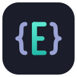

# Editora

[](https://github.com/adriandeleon/Editora/actions/workflows/ci.yml)
[](https://github.com/adriandeleon/Editora/releases/latest)
[](LICENSE)


[](https://github.com/adriandeleon/Editora/stargazers)

A keyboard-driven, cross-platform programmer's text editor built with **JDK 25**, **JavaFX 27**,
[**RichTextFX**](https://github.com/FXMisc/RichTextFX) and **Maven**. Every action is a registered
command, reachable from an Emacs-style keymap or a fuzzy command palette.

🌐 **[editora-project.dev](https://editora-project.dev)** — [features](https://editora-project.dev/#features),
[user docs](https://editora-project.dev/docs/), [screenshots](https://editora-project.dev/screenshots/),
[every command](https://editora-project.dev/commands/), [keybindings](https://editora-project.dev/keybindings/),
[plugins](https://editora-project.dev/plugins/), [what's new](https://editora-project.dev/whats-new/),
[roadmap](https://editora-project.dev/roadmap/) and the [blog](https://editora-project.dev/blog/).
The site's source is [adriandeleon/editora-website](https://github.com/adriandeleon/editora-website).

[](https://editora-project.dev/screenshots/)

Editora is built with the help of AI coding tools.

## Highlights

Each link opens the feature's page on the website; the [user docs](https://editora-project.dev/docs/)
have the full reference.

- **Every action is a command.** Bind it to a key or run it from the fuzzy palette; menus, toolbar
  and keymaps all dispatch through the same registry.
  ([command-driven core](https://editora-project.dev/features/command-driven-core))
- **Five keymaps.** Emacs by default, with chord sequences, the kill ring, rectangles, narrowing and
  a prefix argument; CUA, Sublime Text, VS Code and IntelliJ IDEA too. Switch live, rebind anything.
  ([keymaps](https://editora-project.dev/features/keymaps),
  [Emacs heritage](https://editora-project.dev/features/emacs-heritage))
- **Navigation that keeps your place.** Search Everywhere over commands, files and symbols; a
  server-free symbol index for 16 languages; back/forward, recent locations, peek definition, sticky
  scroll and preview tabs.
  ([Search Everywhere](https://editora-project.dev/features/search-everywhere),
  [code navigation](https://editora-project.dev/features/code-navigation))
- **Code intelligence.** Language servers for 23 languages, auto-detected on `PATH`: diagnostics,
  go-to, rename, code actions, Java refactorings and code generation, inlay hints and code lenses.
  Debug Java, Python and Node over DAP; run files and project main classes with saved configurations.
  ([LSP](https://editora-project.dev/features/lsp),
  [debugging](https://editora-project.dev/features/debugging),
  [run configurations](https://editora-project.dev/features/run-configurations))
- **Git and GitHub through your own CLIs.** Gutter change bars with hunk stage and revert, a Commit
  window, a Git Log with graph and history search, blame, stashes, patches, branches, remotes and
  worktrees; pull requests, reviews and CI runs through `gh`.
  ([Git](https://editora-project.dev/features/git),
  [GitHub](https://editora-project.dev/features/github))
- **Diff and merge.** Side-by-side or unified with word-level highlights, directory compare, a
  three-way resolver for conflicts, and a standalone `--diff-ui` mode.
  ([diff & merge](https://editora-project.dev/features/diff-merge))
- **Previews for what you write.** Markdown with GitHub styling, math, lint and PDF/HTML export;
  Mermaid, Graphviz, PlantUML and Typst; JSON/YAML/TOML/XML trees and OpenAPI docs; SVG, CSV, PDF and
  images; plain-English readings of crontab, fstab, systemd, SSH config, Dockerfile and GitHub
  Actions files.
  ([previews](https://editora-project.dev/features/previews),
  [Markdown](https://editora-project.dev/features/markdown-preview),
  [diagrams](https://editora-project.dev/features/diagrams),
  [Typst](https://editora-project.dev/features/typst))
- **Editing aids.** TextMate highlighting for 40+ languages, snippets for 30, file templates,
  EditorConfig, spell checking, multiple cursors, editor groups, auto-close and auto-rename tags,
  keyboard macros, abbreviations, Local History and crash recovery.
  ([syntax highlighting](https://editora-project.dev/features/syntax-highlighting),
  [snippets](https://editora-project.dev/features/snippets),
  [multiple cursors](https://editora-project.dev/features/multiple-cursors),
  [macros](https://editora-project.dev/features/macros),
  [Local History](https://editora-project.dev/features/local-file-history))
- **Tooling in the window.** Task windows for Maven, Gradle, npm, Cargo and Go; an HTTP client for
  `.http` files; a server log viewer with follow and filters; HTML live preview; remote files over
  SFTP; and a Doctor screen that checks every external tool.
  ([build tools](https://editora-project.dev/features/build-tools),
  [HTTP client](https://editora-project.dev/features/http-client),
  [log viewer](https://editora-project.dev/features/log-viewer),
  [remote files](https://editora-project.dev/features/remote-sftp),
  [Doctor](https://editora-project.dev/features/doctor))
- **Extensible.** Plugins from a signed registry, an AI agent over the Agent Client Protocol plus
  one-shot AI actions, and an embedded MCP server so an agent can drive the editor.
  ([plugins](https://editora-project.dev/features/plugins),
  [AI](https://editora-project.dev/features/ai),
  [MCP](https://editora-project.dev/features/mcp))
- **Yours to shape.** 26 themes, five bundled coding fonts, Zen, Expert and Simple UI modes,
  settings sync through a Git repository you own, and an interface in six languages.
  ([themes & fonts](https://editora-project.dev/features/themes-fonts),
  [Zen mode](https://editora-project.dev/features/zen-mode),
  [settings sync](https://editora-project.dev/features/settings-sync),
  [localized UI](https://editora-project.dev/features/localized-ui))

## Install

Download the package for your platform from [GitHub Releases](https://github.com/adriandeleon/Editora/releases/latest),
or use the OS-detected button on the [home page](https://editora-project.dev/#download).

- **macOS** — `.dmg` for Apple Silicon (`macos-arm64`) or Intel (`macos-x64`).
- **Windows** — `.msi` (x64).
- **Linux** — `.deb`, `.rpm` or `.AppImage` (x64), or a portable `.tar.gz` with an `install.sh`
  (x64 and arm64). The `.deb` and the tarball add an `editora` command and a menu entry.
- **Any OS with a JDK 25** — a per-platform fat jar, run with `java -jar`.

The native packages bundle their own Java runtime. Installers are currently **unsigned**, so macOS
Gatekeeper and Windows SmartScreen stop the first launch until you allow it; the Getting Started and
Troubleshooting pages in the [user docs](https://editora-project.dev/docs/) walk through it.

On startup Editora checks GitHub at most once a day for a newer release and shows an "Update: X.Y.Z"
indicator in the status bar when there is one. The check sends no data and can be switched off under
Settings → Workspace → Updates.

## Build from source

Requires JDK 25 or newer. The Maven wrapper is included (`mvnw.cmd` on Windows); plain `mvn` works too.

```bash
./mvnw javafx:run                 # run the app
./mvnw test                       # run the tests
./mvnw -Pfatjar package           # runnable jar: java -jar target/Editora-<version>.jar
./mvnw clean -Pdist package       # native installer under target/dist/ (DMG, MSI, DEB + RPM)
```

Keep the `clean` in a `dist` build. The fat jar bundles JavaFX for the build host's platform only,
and prints a harmless `Unsupported JavaFX configuration` warning on startup because it runs from
the classpath. The AOT cache, the Linux tarball, the AppImage and the opt-in native-image experiment
are covered in [`docs/building-and-packaging.md`](docs/building-and-packaging.md) and
[`docs/native-image-staticfx.md`](docs/native-image-staticfx.md).

## Command line

```
editora [options] [FILE[:LINE[:COLUMN]] ...]
editora --diff-ui LEFT RIGHT

  --config-dir <path>   Use <path> as the config directory (or set EDITORA_CONFIG_DIR)
  --dev                 Dev mode: use ~/.editora-dev (separate from production config)
  --project[=]<dir>     Open <dir> as a project (only when Projects are enabled)
  --new-file[=name]     Open a new buffer instead of the Welcome page (optionally named)
  --single-window[=project]  Open just one window (the named project, else the no-project window)
                        instead of restoring all windows; doesn't change the saved layout
  --no-session          Open only the files given here; don't restore the saved session
  --new-instance        Start a separate editor process instead of handing this launch
                        to the one already running with the same config directory
  --diff-ui LEFT RIGHT  Compare two files or directories in a standalone diff window
  --zen                 Start in Zen (distraction-free) mode (session only)
  --expert              Start in Expert mode: like Zen, but keeps the editor view (session only)
  --simple              Start in Simple UI mode (minimal chrome; session only)
  --version, -V         Print the version and exit
  --help, -h            Print help and exit
```

File and `--project` arguments are additive: the previous session restores, then the given files
open on top and the caret jumps to any `LINE:COLUMN`. A second launch hands its files to the running
instance unless `--new-instance` is given. The command-line page in the
[user docs](https://editora-project.dev/docs/) has the details and the launcher's location per package.

## Configuration

Preferences live in `~/.editora/settings.json`; session state, recent files, bookmarks, breakpoints,
personal notes, saved SFTP connections and macros are JSON files beside it. Choose another folder
with `--config-dir <path>` or `EDITORA_CONFIG_DIR`, or pass `--dev` to run a development instance on
`~/.editora-dev/` alongside your everyday editor. The configuration page in the
[user docs](https://editora-project.dev/docs/) lists every file and setting.

## Plugins

A curated, signed registry of ready-to-install plugins lives at
[adriandeleon/editora-plugins](https://github.com/adriandeleon/editora-plugins); the
[plugins page](https://editora-project.dev/plugins/) lists them. Enable plugins in Settings → Plugins,
then **Browse plugins…**. Plugins run with full trust (no sandbox), so install only ones you trust.
To write your own, start with [`docs/plugins.md`](docs/plugins.md) and
[`examples/example-plugin/`](examples/example-plugin/).

## Contributing

[`CONTRIBUTING.md`](CONTRIBUTING.md) has the workflow and the conventions a change must follow; the
developer documentation in [`docs/`](docs/README.md) covers architecture, performance rules, an
extension cookbook and the build, test and release guides. Coding agents start at
[`AGENTS.md`](AGENTS.md). Run `./mvnw spotless:apply` before committing and `./mvnw verify` before
pushing. A feature-organized sample corpus for manual testing is under [`samples/`](samples/README.md).

User-facing documentation lives in the [website repository](https://github.com/adriandeleon/editora-website),
not here.

## Releases

A pushed `vX.Y.Z` tag builds native installers and fat jars for Linux (x64, arm64), macOS (x64,
arm64) and Windows (x64) on a GitHub Actions matrix and publishes them with
[JReleaser](https://jreleaser.org); a `-rcN` suffix publishes a pre-release. The steps are in
[`docs/release.md`](docs/release.md).

## License

[MIT](LICENSE) © 2026 Adrián Arturo De León Saldivar

Editora bundles third-party libraries, fonts, snippets and TextMate grammars under their own
licenses. See [NOTICE](NOTICE) for attributions.
