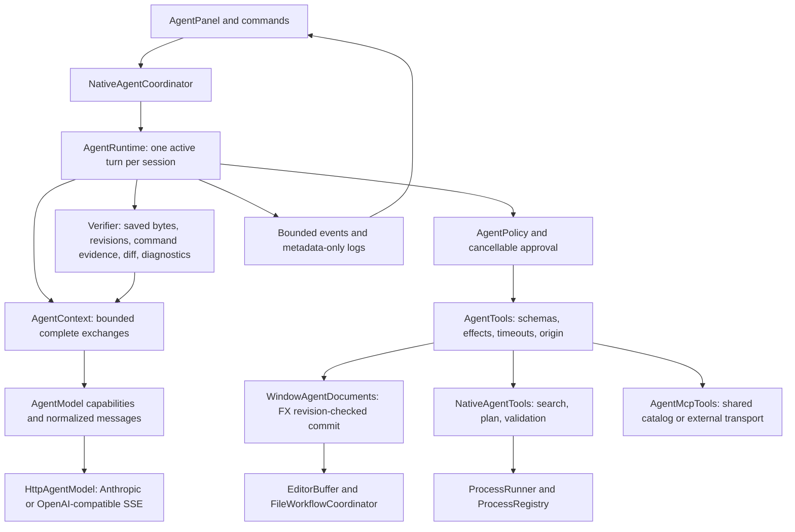

# Embedded agent platform

## Investigation and migration

The original AI system has two independent paths. `AiCoordinator` constructs bounded single-turn
prompts for `AiService` / `AiClient` (Anthropic Messages or OpenAI-compatible SSE); Codex actions use
an isolated read-only ACP process. `AgentCoordinator` launches one `AcpClient` per window, prefixes
path/caret/selection context, sends `session/prompt`, and renders ACP text/tool/plan updates in
`AgentPanel`. ACP providers own reasoning, tools, planning, verification, history and compaction;
Editora cannot enforce an iteration limit inside those processes. Session history stores resumable
ids and titles, not the transcript. LM Studio chat originally required OpenCode's ACP adapter.

Reusable integration points are `EditorBuffer.docVersion`, `replaceWholeDocument` (narrowing and
undo boundaries), background prepared file loads, sequenced conflict-aware document saves,
`SearchService` (ripgrep or Java with live-buffer overlays), `LspManager` (capabilities and async
navigation/refactoring/diagnostics), `GitService`, `DiffEngine` / `DiffCoordinator`, `ProcessRunner`
and `ProcessRegistry`. Coordinators own window state; scene-graph work must stay on FX. VFS paths
may represent SFTP; local LSP/Git/process features explicitly reject remote paths.

The original MCP subsystem was an **inbound server**, not a registry of outbound connections. Its bearer token
grants editor command access. `McpTools` combines schemas and dispatch, and `WindowMcpBridge`
marshals to FX. Its unrestricted command tool cannot be treated as a read-only native agent tool.
Search and Git UI services have generation-based cancellation, so independent agent work must not
silently supersede a user's search. MCP reads have no document revision token and whole-buffer
writes can overwrite newer text. ACP writes also lacked revisions, path confinement and a guard
against a queued FX mutation occurring after its caller timed out. Permission dialogs in ACP are
requests from a trusted external process, not a sandbox around that process.

The largest UX gap is therefore ownership of the execution contract, not Markdown rendering.
The useful benchmark is a loop grounded in actual tool observations, precise editing contracts,
progressive retrieval, cancellation and visible validation. References:
[environment feedback](https://www.anthropic.com/engineering/building-effective-agents),
[bounded, actionable tool results](https://www.anthropic.com/engineering/writing-tools-for-agents),
[local function calling](https://lmstudio.ai/docs/developer/openai-compat/tools).

## Implementation plan

1. Add a toolkit-independent runtime with explicit stop states, provider capabilities, tool metadata,
   centralized policy, cancellation, bounded observations and complete call/result exchanges.
2. Connect a built-in agent to the existing panel and HTTP provider configuration; retain ACP agents.
3. Use a window document adapter for revision-checked multi-file edits, background loading and real
   save completion. Expose focused workspace, search, diagnostics, plan, diff and process tools.
4. Gate completion after mutations on verification observations; errors remain recoverable inputs.
5. Test deterministic model loops, provider streams, permissions, budgets and real FX document races;
   format, run focused tests, then full verification.

Implementation contracts and remaining limits are documented below as the integration is validated.

## Adversarial hardening findings

The first implementation was exercised as hostile state-machine code rather than accepted from its
design claims. The hardening pass found and fixed these defects:

| Severity | Defect | Enforced fix |
| --- | --- | --- |
| High | Any exit-zero command could call itself validation, including `java -version`. A later unvalidated command also left old evidence live. | `purpose` remains a model hint, but trusted code now recognizes build/test/compiler/static-analysis shapes. Unrecognized validation is not executed, and every later command invalidates prior evidence. The result names the evidence class and exact call arguments remain in protocol history. |
| High | Tool-call ids were unique only inside one response, so a provider could reuse an older id and make result association ambiguous. | Ids are nonblank and unique for the entire in-memory session, including compacted exchanges. `AgentContext` independently rejects any exchange without exactly one ordered result per call. |
| High | A mutating handler that committed and then threw could report no `changed` result and reach an ungated final answer. | Once a workspace/destructive handler starts, an exception or cancellation conservatively requires verification. Mutation timeouts still stop the turn because state is uncertain. |
| High | Cancelling or timing out the future returned by an asynchronous save did not itself invalidate the staged write ticket. | Scope cancellation, future cancellation and caller timeout all invalidate the ticket before its atomic commit predicate. Deterministic tests pause the staged write and prove disk remains unchanged. |
| Medium | The minimum context setting left less room than the system/tool catalog plus the fixed output reserve, making a valid configured session fail before its first request. | The minimum is 16,384 tokens and a regression computes the real native catalog cost plus output/user reserves. Context arithmetic uses `long` and rejects nonpositive response budgets. |
| Medium | Open-editor and command checks copied every buffer's full contents in one FX callback, up to the session file limit. | A metadata-only state snapshot carries path/revision/dirty flags. Search retrieves live text progressively; command and open-editor checks never copy document bodies. |
| Medium | A disposed transcript listener could abort an otherwise valid provider exchange. | Streaming view callbacks are isolated from protocol state; lifecycle generation guards still discard callbacks after reset/switch/close. |
| Medium | An interrupted MCP/LSP/Git bridge caller could leave its not-yet-started FX callback queued, and an agent command timeout used the general process grace period. | Bridge futures cancel and queued callbacks check completion before starting. Cancelled/timed-out agent processes are force-killed immediately; a command timeout becomes uncertain workspace state and stops the turn. |
| Medium | An unexpected editor exception after one file in a batch could leave a partial edit outside the session's diff state. | The tool rereads every target after batch failure and adopts every changed revision into review/verification state before returning the failure observation. |

The tests also confirmed the existing revision identity, all-target edit preflight, final-answer
reverification, process-tree interruption, permission centralization and workspace confinement. The
remaining limitations below are limits of evidence or isolation, rather than behavior represented as
stronger than it is.

## Implemented architecture

`AgentCoordinator` keeps the existing panel/client selection. The new **Editora (built-in)** choice
routes to `NativeAgentCoordinator`, which captures provider configuration and workspace identity when
creating a session. It uses AI Actions' provider settings without requiring AI Actions to be enabled.
The default agent choice is unchanged. Settings schema 105 added conservative context/iteration limits;
schema 106 adds managed MCP configuration. Both preserve existing choices through identity migrations. Settings controls and palette
commands (`agent.setMaxIterations`, `agent.setContextTokens`) update the same fields. Limits and model
changes take effect in new sessions; permissions are session-local and reset to Ask.

### Request lifecycle

1. The FX thread captures the goal, optional active path/caret/selection, settings and local project
   root (or active local file's directory). A projectless blank window is not implicitly granted the
   user's home directory. Setup and bounded root `AGENTS.md` acquisition run off FX.
2. The session worker builds a request with tool schemas, user instructions and complete prior
   exchanges. UTF-8 bytes provide a conservative token estimate plus framing/output reserves; this
   is deliberately not a provider tokenizer. Model context size is user-configured, not autodetected.
   The expanded Phase 2 catalog has a 32,768-token minimum, tested with output/user reserves.
3. The HTTP adapter translates normalized messages into Anthropic content blocks or OpenAI chat
   messages. It assembles indexed streamed calls, permits multiple calls, preserves ids/results and
   extracts usage. Missing terminal events and token-limited tool responses fail without executing
   partially streamed calls. Call ids cannot be reused anywhere in the session. Raw reasoning is not
   requested or displayed.
4. The runtime validates arguments before policy evaluation. Calls execute serially, even when a
   model requests several in one response: this preserves predictable write ordering. Read operations
   are automatic; Ask prompts for document mutations. Workspace/Agent allow normal document edits.
   Destructive operations and arbitrary execution still require approval in **every** mode because
   Editora does not provide an OS sandbox. Server annotations cannot lower the external MCP policy.
5. Tool failures become bounded observations. Unknown tools, malformed arguments, denied permissions,
   stale documents and nonzero commands can be corrected in later iterations. A timed-out mutation
   stops with `NEEDS_INPUT`, since its effects cannot safely be assumed absent. Provider failures stop
   the turn; submitting another prompt retains valid conversation state. Automatic provider retries
   are intentionally absent, avoiding duplicate streaming output or uncertain requests.
6. An edit invalidates validation. A candidate final answer triggers the verifier; its observation is
   returned to the model, which may repair and retry. Completion after edits requires a successful
   code-recognized validation command, matching saved document revisions/bytes, and no observed LSP
   errors. Inspection commands do not satisfy the gate and any later command invalidates older evidence.
   The verifier runs again before accepting the subsequent final answer. Recognition establishes that a
   command has build/test/compiler shape; it cannot prove that the chosen target is sufficient. Reports
   must name the actual checks. Unavailable/cached LSP diagnostics are labeled, not represented as a clean build.
7. Stop cancels the turn's scope and child futures, interrupts process waits (which immediately force-kill
   agent process trees),
   closes stalled model reads, and rejects queued FX callbacks. A commit already running on FX finishes
   its short batch; applied changes remain undoable. Cancelling or timing out cannot undo work that
   has already committed. Session reset/switch/close invalidates old UI callbacks and shuts down workers.

### Tools and document transactions

The native catalog includes directory paging, ranged file reads, open-document metadata, bounded
literal search, multi-file exact-text edits, file creation, saving agent revisions, diagnostics,
change review, structured plans and argv execution. Search reuses `MultiFileSearch`/`SearchMatcher`
and `GitignoreFilter`; traversal is independently owned so it cannot cancel the user's Find in Files.
It overlays unsaved buffers and prunes ignored/hidden directories. Results state truncation; agents
narrow paths or reread ranges. Read-file currently opens a background tab, deliberately reusing normal
encoding, document identity and LSP ownership instead of introducing a second document cache.

`AgentMcpTools.editorReads` reuses the existing MCP schemas/dispatch for document symbols and the
existing bridge for Git status. It requires confined symbol paths and a Git root matching the native
workspace. Unrestricted MCP `execute_command`, edit and save tools are **not** imported. The external
transport adapter preserves MCP errors, conservatively classifies external effects and obeys the same
runtime policy/cancellation contract. Phase 2 adds a session-owned outbound stdio connection manager,
settings/health UI and typed cancellable LSP tools; see [IDE-native intelligence](agent-intelligence.md).
Legacy callback-based symbol/Git requests have their existing service deadlines; cancelling their
consumer does not cancel a shared language-server/repository request. Metadata reports that limit.

A native revision token binds **buffer identity + document version**, so close/reopen and an edit
followed by Undo still invalidate an earlier read. A batch validates every path, editability, revision
and unique old-text match before its first mutation. The synchronous FX commit uses
`replaceWholeDocument`, preserving whole-document semantics when narrowed and separating undo groups
from user typing; it flushes LSP changes. Normal user input cannot interleave within that commit.
This is a validated in-memory batch, not a crash-atomic multi-file disk transaction. Each buffer has
its own undo entry. Agent changes stay dirty until `save_files`; saves use the normal sequencer,
atomic writer, encoding, file-watcher acknowledgment and LSP notification, with conflict refusal and
real asynchronous completion. A cancellation invalidates the save ticket up to the disk commit.
Cancelling the save future also invalidates that ticket, so caller timeout cannot leave a staged write
eligible to commit later.

New files are created as editor documents, only under existing directories. No native delete, rename,
move or arbitrary patch parser is added in this pass. Existing ACP open-buffer writes now also use the
whole-document API, fixing narrowed-view duplication/undo grouping, but ACP filesystem requests remain
the older bridge: they do not yet use native revision leases or workspace policy. ACP's own commands
and MCP's externally authenticated command surface remain trusted external automation boundaries.

### Context, state and observability

The runtime retains user instructions and evicts **whole** older model exchanges under pressure,
never leaving orphaned call ids. It validates exact call/result pairing before admitting an exchange
and retains used ids after compaction. It tells the model when compaction occurred. Plans, original text,
changed-file revisions and validation evidence are session state outside the compacted transcript.
`get_plan`, `review_changes` and rereads recover current state; no generated summary is promoted into
trusted instructions. User instructions that themselves exceed the budget stop with a clear limit.
Scoped `AGENTS.md` and user/repository skills are bounded guidance with explicit provenance. Phase 2
adds ranked editor context and historical compaction memory; neither carries security authority.

Tool results are bounded and collapsed in the panel; plans reuse the existing checklist. Lifecycle
states distinguish completion, cancellation, input needed, resource limits and failure. Runtime FINE
logging includes state, tool name, latency, iteration and reported token usage, never prompts, source,
arguments, command environment or credentials. Provider HTTP response and SSE event sizes are bounded.
Debug logs do not contain repository content. Separately, native session checkpoints persist conversation
and tool text locally; the intelligence guide describes storage, privacy and authority reset.

### Security boundary and limitations

| Threat | Code boundary / remaining limit |
| --- | --- |
| Repository/tool prompt injection | Lower-trust context, schema validation and centralized policy; text cannot grant permissions. Model instruction-following alone is not a security boundary. |
| Traversal and ordinary symlink escape | Native resolver confines paths and rejects symlink components, remote filesystems, known credential/internal paths and nonregular text-file targets. |
| Concurrent malicious filesystem changes | Checks do not constitute a kernel sandbox or eliminate all symlink-swap TOCTOU races. Use a trusted local workspace; stronger OS isolation is future work. |
| Newer user edits | Identity/revision preflight on FX; save revision checks; saved-byte verification before/after validation and at final completion. |
| Credential/environment leakage | Known credential paths unavailable to native file tools; child environment allowlist drops inherited API/cloud/SSH tokens. Arbitrary approved programs can still read credentials using OS access. Secret detection is not comprehensive. |
| Command injection | Separate argv, no implicit shell, confined cwd, explicit approval in all trust modes. An explicitly approved shell or program remains arbitrary execution, not a sandboxed workspace capability. |
| Runaway work | Configurable iteration/context limits, call caps, bounded observations/file sizes, operation deadlines and process-tree cancellation. Shared legacy LSP/Git requests have their own deadlines. |
| External agents/MCP | ACP processes and inbound MCP bearer credentials still grant broad external automation; native trust modes do not sandbox them. |

Phase 2 adds turn-boundary session checkpoints, semantic navigation and safe refactoring previews,
individual LSP cancellation, outbound stdio MCP and capability/token-count provenance. Native remote/SSH,
provider-specific reasoning/Responses features, concrete tokenizers and OS execution isolation remain
future work. No concurrent writing subagents are introduced. Read-only exploration subagents should come first, with separate
context budgets and read-only catalogs; any later writer must acquire document/worktree leases.

## Remaining roadmap

Phase 2 is implemented incrementally; [current contracts and Phase 3 priorities](agent-intelligence.md)
supersede the original roadmap below. Items listed here describe the broader target, including
capabilities that require further work.

1. Finish boundary unification: move ACP and inbound-MCP mutations behind document revisions/policy,
   add diagnostic generations and validation provenance, then add OS-isolated command workspaces.
2. Add semantic LSP tools for definitions, references, workspace symbols, hover, code actions, formatting
   and revision-aware rename. Capability absence and stale responses must remain explicit observations.
3. Add hierarchical repository instructions and reusable user skills with source/provenance labels,
   bounded discovery and the same rule that content cannot grant permissions.
4. Persist native goals, plans, decisions, changed-file hashes and compacted summaries. Replay only
   complete protocol exchanges and revalidate every live document/file identity on resume.
5. Improve context retrieval and ranking using symbols, imports, references, diagnostics, recent locations
   and Git changes, with provider-aware token accounting and explainable selection.
6. Build outbound MCP server discovery, connection health, schema compatibility and permission management.
   Treat server descriptions, annotations and results as untrusted; expose cancellation truthfully.
7. Negotiate provider-specific reasoning, structured-output, prompt-caching and context capabilities while
   preserving the neutral runtime contract and safe failure behavior for local/OpenAI-compatible servers.
8. Add remote/SSH agents only after remote document revisions, process isolation and credential boundaries
   match the local guarantees.
9. Evaluate read-only subagents with separate budgets and cancellable read catalogs. Keep concurrent writers
   disabled until worktree/document leases and deterministic merge/conflict handling exist.

## Validation

Deterministic tests exercise zero/empty/multiple calls, many rounds, session-reused ids, failed/malformed
tools, read and mutation timeouts, denied approvals, blocked model reads/tools/permissions, cancellation
during verification, continuation, iteration/context exhaustion, complete-exchange compaction, huge
results, unsupported capabilities, malformed/disconnected streams, both SSE dialects and the actual
loopback HTTP request/result cycle. FX tests exercise stale and reopened documents, unsaved/undo behavior,
all-target preflight, queued and loading cancellation, saved-byte mismatch, new documents, active-session
reset and repeated-turn panel delivery.
Production-host tests exercise background loading, undo after a real save, and cancellation of staged
disk writes through both the operation scope and the save future.
Native-tool tests exercise edit → save → recognized command → verification, irrelevant-command rejection,
user edits during validation, post-validation execution invalidation, cached diagnostic errors, plans,
buffer-aware search and policy isolation. Real-process tests cover timeout, bounded output and interruption.
No normal test needs a live LLM, installed agent, or API key.
