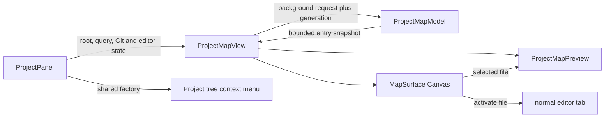

# Project Map canvas navigator

The Project Map is the spatial file navigator in the Project tool window. It complements the
traditional tree; it does not replace the tree or introduce a second file-management model. The
Tree/Map switch chooses the presentation, while both modes share the active project root, search
field, filesystem watcher, file-opening callback, editor and Git state, ordering, icons, and context
menu actions.

The implementation is deliberately hybrid. Native JavaFX controls handle text entry, checkboxes,
buttons, focus, accessibility, and popups. A focusable `Canvas` draws the hierarchy, connectors,
selection state, and overview and performs explicit hit-testing. A separate native overlay provides
the floating code preview.

## User model

The map presents branch-aware Miller columns through the project:

1. The first column contains the project root.
2. Expanding a directory shows its children in a new column at the next depth.
3. Expanding a sibling retains the existing branch and opens another independent column.
4. Closing a column or collapsing its parent removes only that branch and its descendant columns.

Every non-root column has one meaningful parent, but several parents may own independent columns at
the same depth. This keeps parallel work visible without merging unrelated subtrees into one dense
column.

The default flow is right to left. The flow selector also supports left to right, top to bottom, and
bottom to top. It changes column placement, connector direction, and the meaning of the arrow
keys together. Changing flow clears manual column offsets and locks, then fits the new layout. The
last selected flow is stored in workspace state and restored when the editor is reopened.

## Interaction reference

### Pointer

| Gesture | Result |
| --- | --- |
| Single-click a folder | Select and expand it, or collapse it if it is already expanded |
| Single-click a file | Open it in a normal editor tab |
| Click a file's preview icon | Open or focus that file's floating read-only preview on the canvas |
| Right-click a node | Select it and open the same context menu as the Project tree, including first-line bookmark and Personal Note actions |
| Drag empty canvas space | Pan the map |
| Middle-button drag | Pan the map |
| Mouse wheel | Zoom around the pointer position |
| Shortcut + mouse wheel | Zoom faster around the pointer position |
| Shift + mouse wheel | Pan horizontally |
| Alt + mouse wheel | Pan vertically |
| Drag a column header | Move that column independently unless it is locked |
| Click a column lock | Prevent or allow accidental header dragging |
| Click a column close button | Close that branch and all of its descendant columns |
| Click **Print…** | Open the standard print preview for the complete map layout |
| Click **PDF…** | Export the complete map layout using the configured PDF page size |
| Click the overview | Recenter the canvas around that content position |

Floating previews stay at screen scale instead of participating in canvas zoom. Each title bar moves
its card, each lower corner resizes it, and each editor scrolls independently. Opening another file
keeps existing cards visible; clicking an already-previewed file focuses its existing card, and each
close button removes only that card. Initial placement tries to avoid other cards and cascades them
when the viewport cannot fit them without overlap. Up to eight previews remain open, with a ninth
replacing the least recently focused card to keep editor and loader memory bounded.

A preview uses current unsaved text when the file is already open; otherwise it reads the file off
the JavaFX application thread. It is visibly marked read-only, has independent text/image zoom
controls, and renders common bitmap image formats as well as syntax-highlighted text. Its context menu
can copy selected code, select all, add a bookmark at the clicked line, or add a Personal Note for the
selected or clicked lines. The **Open** action promotes the previewed file to a normal editor tab.

Context menus use JavaFX auto-hide plus a next-pulse owner-scene press filter. This mirrors the
other Project menus and ensures a click elsewhere closes the menu even on platforms where the
native popup grab misses the press.

Files with one or more bookmarks or Personal Notes show compact, independently colored indicators
in both the Tree and Map. Marker state is read from an open buffer when available and otherwise from
the active project's persisted stores, so adding an annotation refreshes both views without opening
the target file.

### Keyboard

| Key | Result |
| --- | --- |
| Arrow along the flow | Select the first child, or expand the selected directory |
| Arrow against the flow | Select the parent |
| Perpendicular arrows | Move among siblings |
| `Ctrl-N` / `Ctrl-P` | Select the next or previous sibling |
| `Page Down` / `Page Up` | Move ten siblings forward or backward |
| `Enter` or `Space` | Activate the selected node |
| `Backspace` | Select the parent |
| `Home` | Select the project root |
| `Alt-Left` / `Alt-Right` | Move backward or forward through map selection history |
| `/` | Focus and select the current column's filter text |
| Shortcut + `0` | Fit all visible columns |
| `Escape` | Fit all visible columns |

Text fields own their keystrokes. In particular, `Backspace`, arrows, and `Home` edit a focused
column filter rather than triggering map navigation. Pressing Enter in a column filter returns focus
to the map.

The bottom-left controls provide zoom out, the current percentage, zoom in, Fit, Center selection,
and Reset. Reset restores 100% zoom and clears manual column positions and locks. Initial content is
automatically fitted once the surface has usable dimensions.

## Filters, ordering, and state

The Project tool window's search field becomes the map's global fuzzy name query. It combines with:

- status chips for files that are open, modified, or Git-changed;
- a type selector for source, markup, configuration, other files, or all files;
- a fuzzy free-text filter in every non-root column;
- a per-column **Hidden** checkbox, enabled by default.

The status chips are alternatives to one another: selecting Open and Modified matches either state.
The type and text criteria constrain that working set. A global filename query uses the Project tree's
bounded, off-thread search and temporarily opens every ancestor column needed to reveal its matches;
clearing the query restores the manually expanded branches. Global matches and their ancestors remain
prominent while unrelated nodes fade, preserving spatial context. A column filter removes unmatched rows
and their now-unreachable descendants so the remaining geometry is still a valid hierarchy.

Rows use `ProjectPathOrder`: directories first, then case-insensitive names with a deterministic
case-sensitive tie-break. This is the same ordering contract as the traditional Project explorer.

Canvas nodes reuse `FileIcons.forProjectItem`, rasterized and cached per file kind and status. A file
already open in an editor tab has an accent rail and emphasized label. Modified and Git states add
their corresponding visual status. Tooltips show the full normalized path, type, file size,
modification time, and relevant open, unsaved, or Git status from the loaded snapshot; hover does no
filesystem work.

## Layout and rendering

`ProjectMapView.MapSurface` owns the canvas coordinate system. Node and column geometry is computed
in world coordinates, transformed by zoom and pan, stored as immutable hit boxes, and then painted.
Connectors are drawn before nodes. The live map submits connectors only for destination rows that intersect
the viewport plus a small overscan, so one visible parent cannot make a tall offscreen column rasterize every
Bezier curve. Nodes use the viewport itself, while the overview summarizes the complete laid-out content.
Continuous pan, zoom, and column-drag events update their state immediately but coalesce Canvas rendering to
one repaint per JavaFX pulse.

Print and PDF output temporarily render every laid-out column and connector into a bounded snapshot,
independent of the live viewport. The snapshot preserves the active flow, filters, open branches,
manual column positions, and theme, but omits interactive column controls and the overview. Rendering
is capped by dimension and pixel budgets for large projects. The live canvas size, pan, zoom, and
hover state are restored before print preview or the PDF destination flow continues.

Column cards are content-sized rather than uniform. For each branch column, the map measures every
loaded entry name at the drawing font and reserves enough width for the full label, icon, status
marks, directory arrow, and padding. The minimum node width is 164 pixels. Measuring the underlying
loaded entries—not only the currently filtered rows—keeps widths stable when a filter or Hidden
checkbox is toggled. New columns open beyond their actual parent card in the selected flow direction,
try to center on the item that opened them, and are packed along the perpendicular axis so parallel
branches never overlap.

Column filters, hidden-file checkboxes, lock buttons, and close buttons are ordinary child controls
positioned over the painted column headers after each layout. Detail controls are hidden when zoom
leaves too little header space and return when space is available. They are not drawn into the
canvas, which preserves native text editing, focus traversal, and accessibility.

## Architecture and data flow

Responsibilities are split as follows:

- `ProjectPanel` owns the Tree/Map mode, shared search field, filesystem watcher, root, editor state,
  Git state, open-file action, and construction of the traditional context menu.
- `ProjectMapView` owns expansion, selection history, breadcrumbs, global controls, async reloads,
  print/PDF snapshot actions, and the bounded collection of floating preview cards.
- `ProjectMapModel` is JavaFX-free. It loads normalized metadata snapshots, maintains independent
  branch expansions, groups entries by owning parent, applies ordering and filters, and determines
  emphasized ancestor paths.
- `ProjectMapView.MapSurface` owns paint, layout, transforms, hit-testing, pointer/keyboard input,
  column controls, icon snapshots, and accessibility text.
- `ProjectMapPreview` owns one bounded read-only RichTextFX card, off-thread file loading and syntax
  highlighting, drag/resize behavior, and promotion to an editor tab.

The Project tree is the source of truth for file-management actions. `ProjectPanel` injects a
context-menu factory into the map and calls the same `contextMenuFor(...)` path used by tree cells.
New, Maven, rename, delete, reveal, terminal, local-history, and Git items therefore retain their
existing availability and behavior without a parallel command list.

## Threading, bounds, and lifecycle

Filesystem listing runs on the single daemon `project-map-loader` executor. Each request captures
the root and expanded set; an atomic generation rejects obsolete results before they reach the FX
thread. The model reads only the root and explicitly expanded directories breadth-first, and caps the
visible snapshot at `ProjectMapModel.MAX_VISIBLE_ITEMS` (1,200). A failure to read one directory does
not discard the rest of the snapshot.

Each open preview owns a daemon `project-map-preview-loader`; the eight-card limit bounds their total
number. Every loader queue is coalesced so stale work for that card does not accumulate. Closed text
reads are capped at 1,000,000 bytes, image reads at 20,000,000 bytes, displayed text at 400,000
characters, and syntax highlighting at 160,000 characters. Per-card generation checks guard both
loaded text and highlighting results. Binary and failed reads produce explicit preview states.

All scene-graph mutation, paint, and control synchronization stays on the JavaFX application thread.
No paint, hover, or per-keystroke path accesses the filesystem. `dispose()` invalidates generations,
stops both executors, hides popups and tooltips, and clears control and measurement caches.

Changing roots clears expansion, selection history, per-column filters, positions, locks, zoom, and
preview state. The selected flow is persisted in workspace state; global status/type filters remain
active only in the current view.

## Tests and change checklist

The focused coverage lives in:

- `ProjectMapModelTest` for bounded loading, hidden files, filter semantics, ancestor emphasis,
  independent branch expansion, sorting, and column filtering;
- `ProjectMapViewFxTest` for Tree/Map integration, native icon rasterization, open markers,
  tooltips, single-click expansion, multiple independent previews, shared context menus and dismissal, text-field
  key ownership, content-sized columns, hidden toggles, directional layouts and arrow semantics,
  complete-map output snapshots and live viewport restoration,
  movable/locked columns, overview navigation, and wheel zoom.

When extending the map:

1. Keep filesystem and preview work off the FX thread and generation-guard every result.
2. Keep column state keyed by both depth and owning parent so sibling branches remain independent.
3. Reuse `ProjectPathOrder`, `FileIcons`, the Project context-menu factory, and registered commands.
4. Update connector geometry, arrow semantics, fit bounds, overview bounds, and tests together when
   changing layout.
5. Keep native controls for text entry and popups; ensure the map key filter does not consume their
   editing keys.
6. Add or update every message key in all six localization catalogs.
7. Run `mvn spotless:apply`, the two focused test classes, `git diff --check`, and `mvn verify`.
