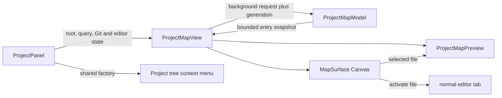

# Project Map canvas navigator

The Project Map is the spatial file navigator in the Project tool window. It complements the
traditional tree; it does not replace the tree or introduce a second file-management model. The
Tree/Map switch chooses the presentation, while both modes share the active project root, search
field, filesystem watcher, file-opening callback, editor and Git state, ordering, icons, and context
menu actions.

The switch is two focus-traversable toggles beside the search field, and the `project.toggleMapView`
command (no default key) flips it from the palette, opening the Project tool window if needed. The
choice is remembered per workspace. The Map lists nothing until it is first shown, and reloads every
time it is entered, so a window that stays on the Tree costs no listing and no loader thread, and
changes made while the Tree was showing are picked up. Returning to the Tree puts the same tree back —
expanded folders and selection included — and only re-lists it.

The implementation is deliberately hybrid. Native JavaFX controls handle text entry, checkboxes,
buttons, focus, accessibility, and popups. A focusable `Canvas` draws the hierarchy, connectors,
selection state, and overview and performs explicit hit-testing. A separate native overlay provides
the floating code preview.

## User model

The map presents branch-aware Miller columns through the project:

1. The first column contains the project root.
2. Expanding a directory shows its children in a new column at the next depth.
3. Expanding a sibling retains the existing branch and opens another independent column.
4. Closing a column or collapsing its parent removes only that branch and its descendant columns.

Every non-root column has one meaningful parent, but several parents may own independent columns at
the same depth. This keeps parallel work visible without merging unrelated subtrees into one dense
column.

The default flow is right to left. The flow selector also supports left to right, top to bottom, and
bottom to top. It changes column placement, connector direction, and the meaning of the arrow
keys together. Changing flow clears manual column offsets and locks, then fits the new layout. The
last selected flow is stored in workspace state and restored when the editor is reopened.

## Interaction reference

### Pointer

| Gesture | Result |
| --- | --- |
| Single-click a folder | Select and expand it; if it is already expanded, select it and bring its column into view |
| Click a folder's chevron (the row's trailing edge) | Expand or collapse it; collapsing closes its descendant columns |
| Single-click a file | Open it in a normal editor tab |
| Click a file's preview icon | Open or focus that file's floating read-only preview on the canvas |
| Right-click a node | Select it and open the same context menu as the Project tree, including first-line bookmark and Personal Note actions |
| Drag empty canvas space | Pan the map |
| Middle-button drag | Pan the map, wherever the drag starts (including on a row) |
| Mouse wheel | Zoom around the pointer position; scroll inertia does not zoom |
| Shortcut + mouse wheel | Zoom faster around the pointer position |
| Horizontal scroll (touchpad swipe, tilt wheel) | Pan horizontally |
| Pinch | Zoom around the gesture |
| Shift + mouse wheel | Pan horizontally |
| Alt + mouse wheel | Pan vertically |
| Drag a column header | Move that column independently unless it is locked; it stops at its parent column |
| Click a column lock | Prevent or allow accidental header dragging |
| Click a column close button | Close that branch and all of its descendant columns |
| Click **Print…** | Open the standard print preview for the complete map layout |
| Click **PDF…** | Export the complete map layout using the configured PDF page size |
| Click the overview | Recenter the canvas around that content position |

Floating previews stay at screen scale instead of participating in canvas zoom. Each title bar moves
its card, each lower corner resizes it, and each editor scrolls independently. Opening another file
keeps existing cards visible; clicking an already-previewed file focuses its existing card, and each
close button removes only that card. An accent connector runs from every preview to its source file row
and follows map pan/zoom plus card movement and resizing.

Code previews and note cards are placed by one path (`ProjectMapView.previewPlacement` over
`MapSurface.previewPlacement`). A card opens beside its row's column — on the side the flow leaves free,
else on the other — when at least the card's minimum size fits there; otherwise it lies over the map
against the panel edge, which is the normal case in a tool-window-wide panel. It is then shifted or
cascaded clear of the cards already open. **Placement never pans the map**, and a card is never smaller
than its minimum (340 × 220 for code, 300 × 180 for notes) unless the panel itself is. Text that arrives
after a card was placed only widens it where it stands, by at most 120 columns and never past the panel;
a card the user moved keeps its position and one the user resized keeps its size.

Up to eight cards remain open, code and note cards together; a ninth replaces the least recently used
one. Pressing a card, moving keyboard focus into it and scrolling it all count as use. A folder's cards
close when the folder stops being expanded, however it was collapsed, and all cards close when the root
changes. Switching to the Tree and back keeps them where they were.

A preview uses current unsaved text when the file is already open; otherwise it reads the file off
the JavaFX application thread, decoded as the editor would open it (BOM, then the `.editorconfig`
charset, then UTF-8 with a single-byte fallback instead of U+FFFD) and with `\n` line endings. It is
visibly marked read-only, has independent text/image zoom controls, and renders common bitmap image
formats as well as syntax-highlighted text. Its context menu can copy selected code, select all, add a
bookmark at the clicked line, or add a Personal Note for the selected or clicked lines. The **Open**
action promotes the previewed file to a normal editor tab.

An open preview is kept current without being moved or re-scrolled: a card that mirrors an open buffer
looks for edits once a second while the Map is on screen and replaces only the range that changed; any
other card re-reads its file when the Project watcher reports a change and the file's size or
modification time differs. A card whose file was deleted or renamed keeps its last text, says the file
no longer exists, and disables **Open**.

`Escape` in a focused card closes it and returns focus to the map; `Tab` leaves the preview's text.
Global chords still act on the active editor tab while a card has focus (the app-wide key policy), so a
focused card has an accent border and its text area's accessible name states the file and that it is
read-only. Cards cannot be moved or resized from the keyboard.

Context menus use JavaFX auto-hide plus a next-pulse owner-scene press filter. This mirrors the
other Project menus and ensures a click elsewhere closes the menu even on platforms where the
native popup grab misses the press.

Files and folders with one or more bookmarks or Personal Notes show compact, independently colored
indicators in both the Tree and Map. Personal Notes indicators are interactive: they open a separate editable note card attached to the same
file or folder row by a connector. A note card and the code preview of the same file open and close
independently, under the shared limit above. The filter row's
default-off “Hide all open Personal Notes” toggle temporarily hides those cards without closing them.
A note card saves an edit on focus loss, Shortcut+Enter or close, comparing against the body the store
last held. It follows the store: when notes change elsewhere it adopts the new bodies (an edit in
progress is kept), and it closes when its notes are deleted. A blanked note is not a deletion — its text
is restored and the status bar says so.
Marker state is read from an open buffer when available and otherwise from
the active project's persisted stores, so adding an annotation refreshes both views without opening
the target file.

### Keyboard

| Key | Result |
| --- | --- |
| Arrow along the flow | Select the first child, or expand the selected directory |
| Arrow against the flow | Select the parent |
| Perpendicular arrows | Move among siblings |
| `Ctrl-N` / `Ctrl-P` | Select the next or previous sibling |
| `Page Down` / `Page Up` | Move ten siblings forward or backward, stopping at the last or first row |
| `Enter` or `Space` | Open the selected file, or expand or collapse the selected folder |
| `F2` | Rename the selected file or folder (not the project root), as in the Project tree |
| `Delete` | Delete the selected file through the Project tree's confirmed delete |
| Menu key / `Shift-F10` | Open the selected node's context menu at its row |
| `Backspace` | Select the parent |
| `Home` | Select the project root |
| `Alt-Left` / `Alt-Right` | Move backward or forward through map selection history |
| `/` | Focus and select the selected column's filter text |
| Shortcut + `0` | Fit all visible columns |
| `Escape` | Close the open preview and note cards; otherwise clear the Project search query; otherwise return focus to the editor |

Single sibling steps (perpendicular arrows, `Ctrl-N` / `Ctrl-P`) wrap around the column; page moves do
not. `/` is matched by the character typed rather than the key, so it works where the slash is a
shifted key and on the numeric keypad. When the selected column's filter is hidden by a low zoom the map
zooms in just far enough and scrolls it into view first; the project column has no filter and reports
that in the status bar.

Text fields own their keystrokes. In particular, `Backspace`, arrows, `Home`, `F2`, and `Delete` edit a
focused column filter rather than triggering map navigation. Pressing Enter in a column filter returns
focus to the map and selects that column's first remaining row unless the selection is already one of
them. Activating a selection whose row a column filter has hidden does nothing. If a focused column
control is hidden (zooming out) or removed (closing its column), focus returns to the map surface.

The scene-level `KeyDispatcher` sees every key before the map. While the surface itself is the focus
owner it declares `Alt-Left`, `Alt-Right`, Shortcut + `0`, `Ctrl-N`, `Ctrl-P`, `F2`, and `Delete` through
`KeyDispatcher.CLAIMED_KEYS`, so they reach it in every bundled keymap instead of running the keymap's
command for the same chord (text-zoom reset, New File, Print, Find File, symbol rename) or being
swallowed as an unbound `Alt` chord. The surface always consumes them; the dispatcher consumes a
claimed `Alt` chord that comes back unconsumed, so none reaches the native menu. The shared Project
search field claims `Ctrl-N` / `Ctrl-P` the same way.

Selection history holds at most 100 entries. A run of sibling moves is one entry, so Back returns to
where the run started rather than retracing each row. Closing a column moves the selection to that
column's folder only when the selection was inside the closed branch.

The bottom-left controls provide zoom out, the current percentage, zoom in, Fit, Center selection,
and Reset. Reset restores 100% zoom and clears manual column positions and locks. Initial content is
automatically fitted once the surface has usable dimensions.

The filter row also has default-on **Keep current zoom** and **Focus new column** options, remembered per
workspace.
Opening a folder therefore preserves the user's scale while centering the newly created column. Either
effect can be disabled independently; disabling zoom preservation restores fit-to-content on expansion.

## Filters, ordering, and state

The Project tool window's search field becomes the map's global fuzzy name query. It combines with:

- status chips for files that are open, modified, Git-changed, bookmarked, or have Personal Notes;
- a type selector for source, markup, configuration, other files, or all files;
- a fuzzy free-text filter in every non-root column;
- a per-column **Show hidden** checkbox.

Hidden (dot) entries follow the Project "show hidden files" setting: it is each column's default, it is
what the loader lists (so hidden entries spend no row budget while it is off), and changing it puts every
column back on the setting. Ticking one column's checkbox overrides the setting for that folder only and
lists the folder again.

The status chips are alternatives to one another: selecting Open and Bookmarks matches either state.
The type and text criteria constrain that working set. Matches and their ancestors remain prominent while
unrelated nodes fade, preserving spatial context. A match does not have to be a loaded row: the Open,
Modified, Bookmarks and Personal Notes chips also light the collapsed folders that hold a matching file,
as the Git chip does. Those ancestor sets come from the open tabs and the marker stores' keys
(`ProjectPanel.setOpenFiles`, `MarkerActions.markedPaths`) by path arithmetic; nothing is read from disk
on the FX thread. Folders match the Bookmarks and Personal Notes chips in their own right.

The type selector asks `ProjectMapModel.classify`, which maps `LanguageRegistry.forFileName` — the
registry behind the file icons and the editor's language detection — to a bucket: program languages are
Source, document and style languages Markup, every other recognized language (data formats, unit files,
the name-determined configuration files) Config. A short extension table covers common types the registry
has no language for, and a few build files (`pom.xml`, `*.gradle`, `CMakeLists.txt`) are pinned to Config.

A global filename query uses the Project tree's bounded, off-thread search and temporarily opens every
ancestor column needed to reveal its matches. The matches are loaded before anything else, in rank order,
so the first match is always present and is selected; when they do not all fit the row limit the status
bar says "showing N of M matches". The search never writes to the manual expansion set. Folders opened or
closed by hand while a query is active (chevron, column ×, a reveal) are kept in the search's own view, so
closing a search-opened column really closes it, and clearing the query restores exactly the manually
expanded branches. Re-running the same query after an in-app file change reloads the map and leaves the
selection alone. A column filter removes unmatched rows and their now-unreachable descendants so the
remaining geometry is still a valid hierarchy.

Rows use `ProjectPathOrder`: directories first, then case-insensitive names with a deterministic
case-sensitive tie-break. This is the same ordering contract as the traditional Project explorer.

Canvas nodes reuse `FileIcons.forProjectItem`, rasterized and cached per file kind and status. A file
already open in an editor tab has an accent rail and emphasized label. Modified and Git states add
their corresponding visual status. Tooltips show the full normalized path, type, file size,
modification time, and relevant open, unsaved, or Git status from the loaded snapshot; hover does no
filesystem work.

## Layout and rendering

`ProjectMapView.MapSurface` owns the canvas coordinate system. Node and column geometry is computed
in world coordinates, transformed by zoom and pan, stored as immutable hit boxes, and then painted.
Connectors are drawn before nodes. The live map submits connectors only for destination rows that intersect
the viewport plus a small overscan, so one visible parent cannot make a tall offscreen column rasterize every
Bezier curve. Nodes use the viewport itself, while the overview summarizes the complete laid-out content.
Continuous pan, zoom, and column-drag events update their state immediately but coalesce Canvas rendering to
one repaint per JavaFX pulse.

Print and PDF output render every laid-out column and connector independent of the live viewport. The
buttons hand the window a deferred `ProjectMapOutput`; nothing is rendered until the page size is known,
so a cancelled PDF dialog costs nothing and print re-renders for the layout chosen in the print dialog.
`ProjectMapOutputPlan` (pure) decides the pages: the map goes on one page while a row label stays at
least 7 pt tall, on a landscape page when it is wider than tall; a larger map keeps that scale and is
tiled across a grid of pages, cut between columns and rows where a gap is in reach, and pages nothing
falls on are left out. The status bar says when the map was scaled down or tiled. A per-page dimension
cap (8,192 px) and a total pixel budget (12 Mpx) remain as a safety net; a map that cannot keep 96 dpi
inside them is still output, with a warning that small labels may be unreadable.

`MapSurface.renderOutput` paints each page on an off-scene `Canvas` — `paint()` draws on the `canvas`
field, which points at it for the duration — so the live Canvas, pan, zoom and hover state are never
touched. A Canvas is backed by one texture of its size times the highest screen scale, and Prism caps a
texture at 4,096 px by default, so a page is assembled from renders of at most 2,048 px (less on a
denser screen). Output always uses a light palette (`outputPalette`, plus looked-up colour overrides
for the rasterized row icons), whatever the live theme; it preserves the active flow, filters, open
branches and manual column positions, and omits the interactive column controls and the overview. Labels
are bitmap, so the PDF is not searchable.

Column cards are content-sized rather than uniform. For each branch column, the map measures every
loaded entry name at the drawing font and reserves enough width for the full label, icon, status
marks, directory arrow, and padding. The minimum node width is 164 pixels. Measuring the underlying
loaded entries—not only the currently filtered rows—keeps widths stable when a filter or Hidden
checkbox is toggled. New columns open beyond their actual parent card in the selected flow direction,
try to center on the item that opened them, and are packed along the perpendicular axis so parallel
branches never overlap.

Column filters, hidden-file checkboxes, lock buttons, and close buttons are ordinary child controls
positioned over the painted column headers after each layout. Detail controls are hidden when zoom
leaves too little header space and return when space is available. They are not drawn into the
canvas, which preserves native text editing, focus traversal, and accessibility.

## Architecture and data flow

```mermaid
flowchart LR
    ProjectPanel[ProjectPanel] -->|root, query, Git and editor state| View[ProjectMapView]
    View -->|background request plus generation| Model[ProjectMapModel]
    Model -->|bounded entry snapshot| View
    View --> Surface[MapSurface Canvas]
    View --> Preview[ProjectMapPreview]
    ProjectPanel -->|shared factory| Menu[Project tree context menu]
    Surface -->|selected file| Preview
    Surface -->|activate file| Editor[normal editor tab]
```

Responsibilities are split as follows:

- `ProjectPanel` owns the Tree/Map mode and its persistence, shared search field, filesystem watcher,
  root, editor state, Git state, open-file action, and construction of the traditional context menu. It
  tells the map when it is on screen (`setActive`), forwards the hidden-files setting, and reports in-app
  renames and moves (`pathRenamed`).
- `ProjectMapView` owns expansion (manual and per-search), row limits, selection history, breadcrumbs,
  global controls, async reloads, the deferred print/PDF job, and the bounded collection of floating
  cards: opening, placement, eviction, refresh scheduling, and closing the cards of a folder that is no
  longer expanded.
- `ProjectMapModel` is JavaFX-free. It loads bounded snapshots with per-directory facts, maintains
  independent branch expansions, groups entries by owning parent, applies ordering and filters,
  classifies file types, and determines emphasized ancestor paths.
- `ProjectMapView.MapSurface` owns paint, layout, transforms, hit-testing, pointer/keyboard input,
  column controls, icon snapshots, and accessibility text.
- `ProjectMapPreview` owns one bounded read-only RichTextFX card, off-thread file loading and syntax
  highlighting, in-place refresh, drag/resize behavior, and promotion to an editor tab.
- `ProjectMapNotePreview` owns one editable Personal Notes card: a text area per note, saving, and
  adopting the store's notes on refresh.
- `ProjectMapOutputPlan` is the JavaFX-free page plan for print/PDF; `ExportCoordinator` renders the
  `ProjectMapOutput` for the PDF page size or the print layout and reports how it was fitted.

The Project tree is the source of truth for file-management actions. `ProjectPanel` injects a
context-menu factory into the map and calls the same `contextMenuFor(...)` path used by tree cells.
New, Maven, rename, delete, reveal, terminal, local-history, and Git items therefore retain their
existing availability and behavior without a parallel command list.

## Threading, bounds, and lifecycle

Filesystem listing runs on the single daemon `project-map-loader` executor, created on the first load.
Each request captures the root, the expanded set, the hidden-files rules, the row limits and the pinned
paths. An atomic generation is checked when a queued request starts and between directories, so a burst of
requests lists the folders once, and obsolete results never reach the FX thread. A request made after
`dispose()` is ignored. Each child costs one attribute read (two for a symbolic link), which serves both
the ordering and the row. A load that outlasts 200 ms shows a "Loading…" label over the canvas, and an
empty map reads "Loading…" rather than "No project items" while its first load is in flight. Every action
still re-lists every expanded directory, and one hung listing still blocks later reloads for that window;
there is no per-directory cache or timeout.

`ProjectMapModel.load` reads only the root and the expanded directories, under two limits:

- **per directory**, `DIRECTORY_CHUNK` (300) rows. A longer directory ends in a "+N more…" row; activating
  it (click, Enter, or the arrow that expands) raises that directory's limit by another chunk.
- **overall**, `MAX_VISIBLE_ITEMS` (1,200) real rows. Pinned paths — the search's matches and a revealed
  file — are charged first, with the rows that lead to them, wherever they sort; the rest is handed out
  breadth-first.

Nothing is dropped silently. The snapshot carries `DirectoryFacts` (real child count, rows loaded,
unreadable) for every listed directory, and a column header shows "shown/total" whenever a filter or a
limit hides rows. A directory that got no rows at all is reported as skipped, is not drawn as expanded,
leaves the manual expansion set, and the status bar says the overall limit was reached; the same message
appears when "+N more…" cannot load anything. An expanded folder with nothing to list gets a column holding
one stub row, "Empty folder" or "Cannot read this folder". A failure to read one directory does not
discard the rest of the snapshot.

The "+N more…" and stub rows are placeholder entries (`Entry.isPlaceholder()`): they flow through layout,
selection and hit-testing like any row, report themselves as directories so file-only behaviour never
applies, are drawn as text by `drawPlaceholderRow`, have no context menu, and are exempt from column
filters. Code that acts on a folder entry must check `isPlaceholder()` first.

After a load the manual expansion set is pruned to folders that actually loaded, so a renamed, deleted or
replaced folder does not leave stale expansion (or watch keys) behind; folders beneath one that could not
be read are kept. An in-app rename or move remaps expansion, limits and the selection to the new path.
`revealPath` adds the target's ancestors to the expansion instead of replacing it, and a pending selection
that a reload does not contain is dropped, together with its selection-history entries.

Each open preview owns a daemon `project-map-preview-loader`; the eight-card limit bounds their total
number. Every loader queue is coalesced so stale work for that card does not accumulate. Closed text
reads are capped at 1,000,000 bytes, image reads at 20,000,000 bytes, displayed text at 400,000
characters, and syntax highlighting at 160,000 characters; neither cap splits a multi-byte sequence or
a surrogate pair. Images are decoded on the loader thread. Per-card generation checks guard both
loaded text and highlighting results. Binary, failed and missing reads produce explicit preview states.
Card refreshes are debounced (250 ms after a state or listing notification, at most once a second for
content-only disk changes and for following an open buffer) and stop while the Map is off screen.

All scene-graph mutation, paint, and control synchronization stays on the JavaFX application thread.
No paint, hover, or per-keystroke path accesses the filesystem. `dispose()` invalidates generations,
stops both executors, hides popups and tooltips, and clears control and measurement caches.

Changing roots clears expansion, selection history, per-column filters, positions, locks, zoom, and
preview state. The view remembers the open branches, row limits and selection of the last eight local
folders it showed, so in the window with no project — where the root follows the active tab's folder —
switching back to a folder restores its map instead of starting from the root; zoom and column positions
are not carried over. Workspace state (schema v13) persists the Tree/Map choice, the flow, and the two
navigation options; expansion, zoom and the status/type filters are not persisted.

## Tests and change checklist

The focused coverage lives in:

- `ProjectMapModelTest` for hidden files, filter semantics, ancestor emphasis, independent branch
  expansion, sorting, and column filtering;
- `ProjectMapModelLoadingTest` for the per-directory and overall limits, "+N more" and stub rows,
  pinned paths, cancellation, expansion pruning, rename remapping, and type classification;
- `ProjectMapDataFxTest` for deferred and re-entered loading, the Tree round trip, reloads during a
  search, search expansion and its status message, reveal, the hidden-files setting, chip emphasis of
  collapsed folders, folder markers, remembered mode and options, and per-folder memory;
- `ProjectMapInputFxTest` for keyboard and pointer input: real key events fired through a wired window
  under the Emacs, CUA, VS Code, IntelliJ, and Sublime keymaps, `/` by typed character, the keyboard
  context menu, row keys, Escape, history coalescing, header drags, hover, and wheel and pinch gestures;
- `ProjectMapOutputPlanTest` for the print/PDF page plan (fit, scale, tiling, cuts, budgets), the paged
  PDF writer, and preview decoding at the read caps;
- `ProjectMapCardsFxTest` for whole-map output beyond the viewport in a light palette, deferred PDF
  rendering, card placement in narrow panels without panning, late-load growth, decoding and CRLF
  highlighting, buffer/disk refresh and missing files, note-card saving and refresh, Escape/Tab, the
  shared card limit, closing cards on collapse, and keeping cards across a Tree/Map switch;
- `ProjectMapViewFxTest` for Tree/Map integration, native icon rasterization, open markers,
  tooltips, single-click expansion, multiple independent previews, shared context menus and dismissal, text-field
  key ownership, content-sized columns, hidden toggles, directional layouts and arrow semantics,
  complete-map output snapshots and live viewport restoration,
  movable/locked columns, overview navigation, and wheel zoom.

When extending the map:

1. Keep filesystem and preview work off the FX thread and generation-guard every result.
2. Keep column state keyed by both depth and owning parent so sibling branches remain independent.
3. Reuse `ProjectPathOrder`, `FileIcons`, the Project context-menu factory, and registered commands.
4. Update connector geometry, arrow semantics, fit bounds, overview bounds, and tests together when
   changing layout.
5. Keep native controls for text entry and popups; ensure the map key filter does not consume their
   editing keys.
6. Add or update every message key in all six localization catalogs.
7. When adding a key, check it against every bundled keymap: a chord the keymap binds, or any unbound
   `Alt` chord, reaches the surface only if it is in `ProjectMapView.claimedChords`.
8. Run `mvn spotless:apply`, the focused test classes, `git diff --check`, and `mvn verify`.
