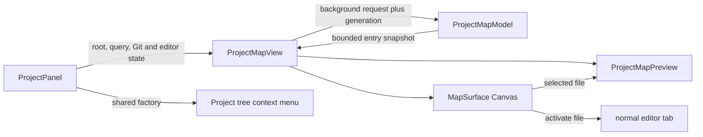

# Project Map canvas navigator

The Project Map is the spatial file navigator in the Project tool window. It complements the
traditional tree; it does not replace the tree or introduce a second file-management model. The
Tree/Map switch chooses the presentation, while both modes share the active project root, search
field, filesystem watcher, file-opening callback, editor and Git state, ordering, icons, and context
menu actions.

The switch is two focus-traversable toggles beside the search field, and the `project.toggleMapView`
command (no default key) flips it from the palette, opening the Project tool window if needed. The
choice is remembered per workspace. The Map lists nothing until it is first shown, and reloads every
time it is entered, so a window that stays on the Tree costs no listing and no loader thread, and
changes made while the Tree was showing are picked up. Returning to the Tree puts the same tree back —
expanded folders and selection included — and only re-lists it.

The implementation is deliberately hybrid. Native JavaFX controls handle text entry, checkboxes,
buttons, focus, accessibility, and popups. A focusable `Canvas` draws the hierarchy, connectors,
selection state, and overview and performs explicit hit-testing. A separate native overlay provides
the floating code preview.

## User model

The map presents branch-aware Miller columns through the project:

1. The first column contains the project root.
2. Expanding a directory shows its children in a new column at the next depth.
3. Expanding a sibling retains the existing branch and opens another independent column.
4. Closing a column or collapsing its parent removes only that branch and its descendant columns.

Every non-root column has one meaningful parent, but several parents may own independent columns at
the same depth. This keeps parallel work visible without merging unrelated subtrees into one dense
column.

The default flow is right to left. The flow selector also supports left to right, top to bottom, and
bottom to top. It changes column placement, connector direction, and the meaning of the arrow
keys together. Changing flow clears manual column offsets and locks, then fits the new layout. The
last selected flow is stored in workspace state and restored when the editor is reopened.

## Interaction reference

### Pointer

| Gesture | Result |
| --- | --- |
| Single-click a folder | Select and expand it, or collapse it if it is already expanded |
| Single-click a file | Open it in a normal editor tab |
| Click a file's preview icon | Open or focus that file's floating read-only preview on the canvas |
| Right-click a node | Select it and open the same context menu as the Project tree, including first-line bookmark and Personal Note actions |
| Drag empty canvas space | Pan the map |
| Middle-button drag | Pan the map |
| Mouse wheel | Zoom around the pointer position |
| Shortcut + mouse wheel | Zoom faster around the pointer position |
| Shift + mouse wheel | Pan horizontally |
| Alt + mouse wheel | Pan vertically |
| Drag a column header | Move that column independently unless it is locked |
| Click a column lock | Prevent or allow accidental header dragging |
| Click a column close button | Close that branch and all of its descendant columns |
| Click **Print…** | Open the standard print preview for the complete map layout |
| Click **PDF…** | Export the complete map layout using the configured PDF page size |
| Click the overview | Recenter the canvas around that content position |

Floating previews stay at screen scale instead of participating in canvas zoom. Each title bar moves
its card, each lower corner resizes it, and each editor scrolls independently. Opening another file
keeps existing cards visible; clicking an already-previewed file focuses its existing card, and each
close button removes only that card. An accent connector runs from every preview to its source file row
and follows map pan/zoom plus card movement and resizing. Initial placement tries to avoid other cards
and cascades them when the viewport cannot fit them without overlap. Up to eight previews remain open,
with a ninth replacing the least recently focused card to keep editor and loader memory bounded.

A preview uses current unsaved text when the file is already open; otherwise it reads the file off
the JavaFX application thread. It is visibly marked read-only, has independent text/image zoom
controls, and renders common bitmap image formats as well as syntax-highlighted text. Its context menu
can copy selected code, select all, add a bookmark at the clicked line, or add a Personal Note for the
selected or clicked lines. The **Open** action promotes the previewed file to a normal editor tab.

Context menus use JavaFX auto-hide plus a next-pulse owner-scene press filter. This mirrors the
other Project menus and ensures a click elsewhere closes the menu even on platforms where the
native popup grab misses the press.

Files and folders with one or more bookmarks or Personal Notes show compact, independently colored
indicators in both the Tree and Map. Personal Notes indicators are interactive: they open a separate editable note card attached to the same
file or folder row by a connector. Note cards and code previews have independent lifecycles. The filter row's
default-off “Hide all open Personal Notes” toggle temporarily hides those cards without closing them.
Marker state is read from an open buffer when available and otherwise from
the active project's persisted stores, so adding an annotation refreshes both views without opening
the target file.

### Keyboard

| Key | Result |
| --- | --- |
| Arrow along the flow | Select the first child, or expand the selected directory |
| Arrow against the flow | Select the parent |
| Perpendicular arrows | Move among siblings |
| `Ctrl-N` / `Ctrl-P` | Select the next or previous sibling |
| `Page Down` / `Page Up` | Move ten siblings forward or backward |
| `Enter` or `Space` | Activate the selected node |
| `Backspace` | Select the parent |
| `Home` | Select the project root |
| `Alt-Left` / `Alt-Right` | Move backward or forward through map selection history |
| `/` | Focus and select the current column's filter text |
| Shortcut + `0` | Fit all visible columns |
| `Escape` | Fit all visible columns |

Text fields own their keystrokes. In particular, `Backspace`, arrows, and `Home` edit a focused
column filter rather than triggering map navigation. Pressing Enter in a column filter returns focus
to the map.

The bottom-left controls provide zoom out, the current percentage, zoom in, Fit, Center selection,
and Reset. Reset restores 100% zoom and clears manual column positions and locks. Initial content is
automatically fitted once the surface has usable dimensions.

The filter row also has default-on **Keep current zoom** and **Focus new column** options, remembered per
workspace.
Opening a folder therefore preserves the user's scale while centering the newly created column. Either
effect can be disabled independently; disabling zoom preservation restores fit-to-content on expansion.

## Filters, ordering, and state

The Project tool window's search field becomes the map's global fuzzy name query. It combines with:

- status chips for files that are open, modified, Git-changed, bookmarked, or have Personal Notes;
- a type selector for source, markup, configuration, other files, or all files;
- a fuzzy free-text filter in every non-root column;
- a per-column **Show hidden** checkbox.

Hidden (dot) entries follow the Project "show hidden files" setting: it is each column's default, it is
what the loader lists (so hidden entries spend no row budget while it is off), and changing it puts every
column back on the setting. Ticking one column's checkbox overrides the setting for that folder only and
lists the folder again.

The status chips are alternatives to one another: selecting Open and Bookmarks matches either state.
The type and text criteria constrain that working set. Matches and their ancestors remain prominent while
unrelated nodes fade, preserving spatial context. A match does not have to be a loaded row: the Open,
Modified, Bookmarks and Personal Notes chips also light the collapsed folders that hold a matching file,
as the Git chip does. Those ancestor sets come from the open tabs and the marker stores' keys
(`ProjectPanel.setOpenFiles`, `MarkerActions.markedPaths`) by path arithmetic; nothing is read from disk
on the FX thread. Folders match the Bookmarks and Personal Notes chips in their own right.

The type selector asks `ProjectMapModel.classify`, which maps `LanguageRegistry.forFileName` — the
registry behind the file icons and the editor's language detection — to a bucket: program languages are
Source, document and style languages Markup, every other recognized language (data formats, unit files,
the name-determined configuration files) Config. A short extension table covers common types the registry
has no language for, and a few build files (`pom.xml`, `*.gradle`, `CMakeLists.txt`) are pinned to Config.

A global filename query uses the Project tree's bounded, off-thread search and temporarily opens every
ancestor column needed to reveal its matches. The matches are loaded before anything else, in rank order,
so the first match is always present and is selected; when they do not all fit the row limit the status
bar says "showing N of M matches". The search never writes to the manual expansion set. Folders opened or
closed by hand while a query is active (chevron, column ×, a reveal) are kept in the search's own view, so
closing a search-opened column really closes it, and clearing the query restores exactly the manually
expanded branches. Re-running the same query after an in-app file change reloads the map and leaves the
selection alone. A column filter removes unmatched rows and their now-unreachable descendants so the
remaining geometry is still a valid hierarchy.

Rows use `ProjectPathOrder`: directories first, then case-insensitive names with a deterministic
case-sensitive tie-break. This is the same ordering contract as the traditional Project explorer.

Canvas nodes reuse `FileIcons.forProjectItem`, rasterized and cached per file kind and status. A file
already open in an editor tab has an accent rail and emphasized label. Modified and Git states add
their corresponding visual status. Tooltips show the full normalized path, type, file size,
modification time, and relevant open, unsaved, or Git status from the loaded snapshot; hover does no
filesystem work.

## Layout and rendering

`ProjectMapView.MapSurface` owns the canvas coordinate system. Node and column geometry is computed
in world coordinates, transformed by zoom and pan, stored as immutable hit boxes, and then painted.
Connectors are drawn before nodes. The live map submits connectors only for destination rows that intersect
the viewport plus a small overscan, so one visible parent cannot make a tall offscreen column rasterize every
Bezier curve. Nodes use the viewport itself, while the overview summarizes the complete laid-out content.
Continuous pan, zoom, and column-drag events update their state immediately but coalesce Canvas rendering to
one repaint per JavaFX pulse.

Print and PDF output temporarily render every laid-out column and connector into a bounded snapshot,
independent of the live viewport. The snapshot preserves the active flow, filters, open branches,
manual column positions, and theme, but omits interactive column controls and the overview. Rendering
is capped by dimension and pixel budgets for large projects. The live canvas size, pan, zoom, and
hover state are restored before print preview or the PDF destination flow continues.

Column cards are content-sized rather than uniform. For each branch column, the map measures every
loaded entry name at the drawing font and reserves enough width for the full label, icon, status
marks, directory arrow, and padding. The minimum node width is 164 pixels. Measuring the underlying
loaded entries—not only the currently filtered rows—keeps widths stable when a filter or Hidden
checkbox is toggled. New columns open beyond their actual parent card in the selected flow direction,
try to center on the item that opened them, and are packed along the perpendicular axis so parallel
branches never overlap.

Column filters, hidden-file checkboxes, lock buttons, and close buttons are ordinary child controls
positioned over the painted column headers after each layout. Detail controls are hidden when zoom
leaves too little header space and return when space is available. They are not drawn into the
canvas, which preserves native text editing, focus traversal, and accessibility.

## Architecture and data flow

```mermaid
flowchart LR
    ProjectPanel[ProjectPanel] -->|root, query, Git and editor state| View[ProjectMapView]
    View -->|background request plus generation| Model[ProjectMapModel]
    Model -->|bounded entry snapshot| View
    View --> Surface[MapSurface Canvas]
    View --> Preview[ProjectMapPreview]
    ProjectPanel -->|shared factory| Menu[Project tree context menu]
    Surface -->|selected file| Preview
    Surface -->|activate file| Editor[normal editor tab]
```

Responsibilities are split as follows:

- `ProjectPanel` owns the Tree/Map mode and its persistence, shared search field, filesystem watcher,
  root, editor state, Git state, open-file action, and construction of the traditional context menu. It
  tells the map when it is on screen (`setActive`), forwards the hidden-files setting, and reports in-app
  renames and moves (`pathRenamed`).
- `ProjectMapView` owns expansion (manual and per-search), row limits, selection history, breadcrumbs,
  global controls, async reloads, print/PDF snapshot actions, and the bounded collection of floating
  preview cards.
- `ProjectMapModel` is JavaFX-free. It loads bounded snapshots with per-directory facts, maintains
  independent branch expansions, groups entries by owning parent, applies ordering and filters,
  classifies file types, and determines emphasized ancestor paths.
- `ProjectMapView.MapSurface` owns paint, layout, transforms, hit-testing, pointer/keyboard input,
  column controls, icon snapshots, and accessibility text.
- `ProjectMapPreview` owns one bounded read-only RichTextFX card, off-thread file loading and syntax
  highlighting, drag/resize behavior, and promotion to an editor tab.

The Project tree is the source of truth for file-management actions. `ProjectPanel` injects a
context-menu factory into the map and calls the same `contextMenuFor(...)` path used by tree cells.
New, Maven, rename, delete, reveal, terminal, local-history, and Git items therefore retain their
existing availability and behavior without a parallel command list.

## Threading, bounds, and lifecycle

Filesystem listing runs on the single daemon `project-map-loader` executor, created on the first load.
Each request captures the root, the expanded set, the hidden-files rules, the row limits and the pinned
paths. An atomic generation is checked when a queued request starts and between directories, so a burst of
requests lists the folders once, and obsolete results never reach the FX thread. A request made after
`dispose()` is ignored. Each child costs one attribute read (two for a symbolic link), which serves both
the ordering and the row. A load that outlasts 200 ms shows a "Loading…" label over the canvas, and an
empty map reads "Loading…" rather than "No project items" while its first load is in flight. Every action
still re-lists every expanded directory, and one hung listing still blocks later reloads for that window;
there is no per-directory cache or timeout.

`ProjectMapModel.load` reads only the root and the expanded directories, under two limits:

- **per directory**, `DIRECTORY_CHUNK` (300) rows. A longer directory ends in a "+N more…" row; activating
  it (click, Enter, or the arrow that expands) raises that directory's limit by another chunk.
- **overall**, `MAX_VISIBLE_ITEMS` (1,200) real rows. Pinned paths — the search's matches and a revealed
  file — are charged first, with the rows that lead to them, wherever they sort; the rest is handed out
  breadth-first.

Nothing is dropped silently. The snapshot carries `DirectoryFacts` (real child count, rows loaded,
unreadable) for every listed directory, and a column header shows "shown/total" whenever a filter or a
limit hides rows. A directory that got no rows at all is reported as skipped, is not drawn as expanded,
leaves the manual expansion set, and the status bar says the overall limit was reached; the same message
appears when "+N more…" cannot load anything. An expanded folder with nothing to list gets a column holding
one stub row, "Empty folder" or "Cannot read this folder". A failure to read one directory does not
discard the rest of the snapshot.

The "+N more…" and stub rows are placeholder entries (`Entry.isPlaceholder()`): they flow through layout,
selection and hit-testing like any row, report themselves as directories so file-only behaviour never
applies, are drawn as text by `drawPlaceholderRow`, have no context menu, and are exempt from column
filters. Code that acts on a folder entry must check `isPlaceholder()` first.

After a load the manual expansion set is pruned to folders that actually loaded, so a renamed, deleted or
replaced folder does not leave stale expansion (or watch keys) behind; folders beneath one that could not
be read are kept. An in-app rename or move remaps expansion, limits and the selection to the new path.
`revealPath` adds the target's ancestors to the expansion instead of replacing it, and a pending selection
that a reload does not contain is dropped, together with its selection-history entries.

Each open preview owns a daemon `project-map-preview-loader`; the eight-card limit bounds their total
number. Every loader queue is coalesced so stale work for that card does not accumulate. Closed text
reads are capped at 1,000,000 bytes, image reads at 20,000,000 bytes, displayed text at 400,000
characters, and syntax highlighting at 160,000 characters. Per-card generation checks guard both
loaded text and highlighting results. Binary and failed reads produce explicit preview states.

All scene-graph mutation, paint, and control synchronization stays on the JavaFX application thread.
No paint, hover, or per-keystroke path accesses the filesystem. `dispose()` invalidates generations,
stops both executors, hides popups and tooltips, and clears control and measurement caches.

Changing roots clears expansion, selection history, per-column filters, positions, locks, zoom, and
preview state. The view remembers the open branches, row limits and selection of the last eight local
folders it showed, so in the window with no project — where the root follows the active tab's folder —
switching back to a folder restores its map instead of starting from the root; zoom and column positions
are not carried over. Workspace state (schema v13) persists the Tree/Map choice, the flow, and the two
navigation options; expansion, zoom and the status/type filters are not persisted.

## Tests and change checklist

The focused coverage lives in:

- `ProjectMapModelTest` for hidden files, filter semantics, ancestor emphasis, independent branch
  expansion, sorting, and column filtering;
- `ProjectMapModelLoadingTest` for the per-directory and overall limits, "+N more" and stub rows,
  pinned paths, cancellation, expansion pruning, rename remapping, and type classification;
- `ProjectMapDataFxTest` for deferred and re-entered loading, the Tree round trip, reloads during a
  search, search expansion and its status message, reveal, the hidden-files setting, chip emphasis of
  collapsed folders, folder markers, remembered mode and options, and per-folder memory;
- `ProjectMapViewFxTest` for Tree/Map integration, native icon rasterization, open markers,
  tooltips, single-click expansion, multiple independent previews, shared context menus and dismissal, text-field
  key ownership, content-sized columns, hidden toggles, directional layouts and arrow semantics,
  complete-map output snapshots and live viewport restoration,
  movable/locked columns, overview navigation, and wheel zoom.

When extending the map:

1. Keep filesystem and preview work off the FX thread and generation-guard every result.
2. Keep column state keyed by both depth and owning parent so sibling branches remain independent.
3. Reuse `ProjectPathOrder`, `FileIcons`, the Project context-menu factory, and registered commands.
4. Update connector geometry, arrow semantics, fit bounds, overview bounds, and tests together when
   changing layout.
5. Keep native controls for text entry and popups; ensure the map key filter does not consume their
   editing keys.
6. Add or update every message key in all six localization catalogs.
7. Run `mvn spotless:apply`, the two focused test classes, `git diff --check`, and `mvn verify`.
