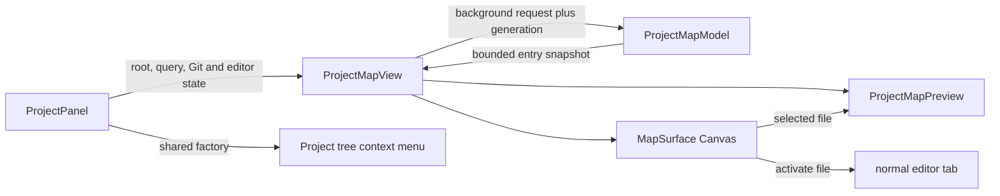

# Project Map canvas navigator

The Project Map is the spatial file navigator in the Project tool window. It complements the
traditional tree; it does not replace the tree or introduce a second file-management model. The
Tree/Map switch chooses the presentation, while both modes share the active project root, search
field, filesystem watcher, file-opening callback, editor and Git state, ordering, icons, and context
menu actions.

The implementation is deliberately hybrid. Native JavaFX controls handle text entry, checkboxes,
buttons, focus, accessibility, and popups. A focusable `Canvas` draws the hierarchy, connectors,
selection state, and overview and performs explicit hit-testing. A separate native overlay provides
the floating code preview.

## User model

The map presents branch-aware Miller columns through the project:

1. The first column contains the project root.
2. Expanding a directory shows its children in a new column at the next depth.
3. Expanding a sibling retains the existing branch and opens another independent column.
4. Closing a column or collapsing its parent removes only that branch and its descendant columns.

Every non-root column has one meaningful parent, but several parents may own independent columns at
the same depth. This keeps parallel work visible without merging unrelated subtrees into one dense
column.

The default flow is left to right (`ProjectMapView.DEFAULT_FLOW`), the direction the breadcrumb and
the Tree read in. The flow selector also supports right to left, top to bottom, and bottom to top. It
changes column placement, connector direction, and the meaning of the arrow keys together. Changing
flow clears manual column offsets and locks, then auto-fits the new layout. The last selected flow is
stored in workspace state and restored when the editor is reopened.

## Interaction reference

### Pointer

| Gesture | Result |
| --- | --- |
| Single-click a folder | Select and expand it, or collapse it if it is already expanded |
| Single-click a file | Open it in a normal editor tab |
| Click a file's preview icon | Open or focus that file's floating read-only preview on the canvas |
| Right-click a node | Select it and open the same context menu as the Project tree, including first-line bookmark and Personal Note actions |
| Drag empty canvas space | Pan the map |
| Middle-button drag | Pan the map |
| Mouse wheel | Zoom around the pointer position |
| Shortcut + mouse wheel | Zoom faster around the pointer position |
| Shift + mouse wheel | Pan horizontally |
| Alt + mouse wheel | Pan vertically |
| Drag a column header | Move that column independently unless it is locked |
| Click a column lock | Prevent or allow accidental header dragging |
| Click a column close button | Close that branch and all of its descendant columns |
| Options (⋯) menu → **Print…** | Open the standard print preview for the complete map layout |
| Options (⋯) menu → **PDF…** | Export the complete map layout using the configured PDF page size |
| Click **?** | Show the mouse and keyboard model in a popover |
| Click the overview | Recenter the canvas around that content position |

Floating previews stay at screen scale instead of participating in canvas zoom. Each title bar moves
its card, each lower corner resizes it, and each editor scrolls independently. Opening another file
keeps existing cards visible; clicking an already-previewed file focuses its existing card, and each
close button removes only that card. An accent connector runs from every preview to its source file row
and follows map pan/zoom plus card movement and resizing. Initial placement tries to avoid other cards
and cascades them when the viewport cannot fit them without overlap. Up to eight previews remain open,
with a ninth replacing the least recently focused card to keep editor and loader memory bounded.

A preview uses current unsaved text when the file is already open; otherwise it reads the file off
the JavaFX application thread. It is visibly marked read-only, has independent text/image zoom
controls, and renders common bitmap image formats as well as syntax-highlighted text. Its context menu
can copy selected code, select all, add a bookmark at the clicked line, or add a Personal Note for the
selected or clicked lines. The **Open** action promotes the previewed file to a normal editor tab.

Context menus use JavaFX auto-hide plus a next-pulse owner-scene press filter. This mirrors the
other Project menus and ensures a click elsewhere closes the menu even on platforms where the
native popup grab misses the press.

Files with one or more bookmarks or Personal Notes show compact, independently colored indicators
in both the Tree and Map. Personal Notes indicators are interactive: they open a separate editable note card attached to the same
file or folder row by a connector. Note cards and code previews have independent lifecycles. The options
menu's default-off “Hide all open Personal Notes” item temporarily hides those cards without closing them.
A note card is styled from the theme's warning (amber) tokens, so it is a pale sheet on light themes and a
dark amber one on dark themes.
Marker state is read from an open buffer when available and otherwise from
the active project's persisted stores, so adding an annotation refreshes both views without opening
the target file.

### Keyboard

| Key | Result |
| --- | --- |
| Arrow along the flow | Select the first child, or expand the selected directory |
| Arrow against the flow | Select the parent |
| Perpendicular arrows | Move among siblings |
| `Ctrl-N` / `Ctrl-P` | Select the next or previous sibling |
| `Page Down` / `Page Up` | Move ten siblings forward or backward |
| `Enter` or `Space` | Activate the selected node |
| `Backspace` | Select the parent |
| `Home` | Select the project root |
| `Alt-Left` / `Alt-Right` | Move backward or forward through map selection history |
| `/` | Focus and select the current column's filter text |
| Shortcut + `0` | Fit all visible columns |
| `Escape` | Fit all visible columns |

Text fields own their keystrokes. In particular, `Backspace`, arrows, and `Home` edit a focused
column filter rather than triggering map navigation. Pressing Enter in a column filter returns focus
to the map.

The bottom-left zoom bar is icon buttons (each with a tooltip and accessible name) around the current
percentage: zoom out, zoom in, Fit, Center selection, and Reset. Manual zoom runs from 40% to 225%.

- The **first view** of a project opens at 100% with the root column and the start of the first column in
  view (a small project that fits is centred instead). It steps down, never below 85%, only when that is
  what shows both columns.
- **Fit** (the button or Shortcut + `0`) scales and centres the whole map when that is possible at 40% or
  more. When the floor is hit it anchors on the selected path instead: the selected row, its column
  header, and as many of the columns leading to it as the view holds.
- **Auto-fit** (changing flow, or opening a folder with Keep current zoom off) does the same with 85% as
  its floor, so the map never shrinks to an unreadable thumbnail by itself.
- **Reset** restores 100%, clears manual column positions and locks, and returns to the first view.

Reveal, Fit and the first view reserve the strip the zoom bar covers, and a revealed row is also lifted
clear of the overview.

The options (⋯) menu in the navigation row holds the default-on **Keep current zoom** and **Focus new
column** session options (`isKeepZoom()` / `isFocusNewColumn()` and their setters on the view). Opening a
folder therefore preserves the user's scale and brings the new column in from its start: the whole card
when it fits beside the row that opened it, otherwise its header and first rows together with that row.
Either effect can be disabled independently; disabling zoom preservation restores auto-fit on expansion.

The filter row holds only filters and wraps instead of truncating; the selectors show their value alone
("Source", "Left → Right") and carry the "Type:" / "Flow:" form as tooltip and accessible name. Breadcrumbs
that do not fit collapse their middle into one "…" (whose tooltip lists the hidden folders) and keep the
root and the last two crumbs.

## Filters, ordering, and state

The Project tool window's search field becomes the map's global fuzzy name query. It combines with:

- status chips for files that are open, modified, Git-changed, bookmarked, or have Personal Notes;
- a type selector for source, markup, configuration, other files, or all files;
- a fuzzy free-text filter in every non-root column;
- a per-column **Hidden** checkbox, enabled by default.

The status chips are alternatives to one another: selecting Open and Bookmarks matches either state.
The type and text criteria constrain that working set. A global filename query uses the Project tree's
bounded, off-thread search and temporarily opens every ancestor column needed to reveal its matches;
clearing the query restores the manually expanded branches. Global matches and their ancestors remain
prominent while unrelated nodes fade, preserving spatial context. A column filter removes unmatched rows
and their now-unreachable descendants so the remaining geometry is still a valid hierarchy.

When a query or chip is active and no loaded row matches, a "No files match" message (with the query)
appears over the canvas once that state has lasted 300 ms — a global query first fades what is loaded and
only then opens the folders that hold its matches. The viewport is not moved. A column whose own filter
matches nothing keeps one row of space for a "No matches" line.

Rows use `ProjectPathOrder`: directories first, then case-insensitive names with a deterministic
case-sensitive tie-break. This is the same ordering contract as the traditional Project explorer.

Canvas nodes reuse `FileIcons.forProjectItem`, rasterized and cached per file kind and status (plus an
on-accent variant, style class `project-map-icon-on-accent`, for the focused selection). A file already
open in an editor tab has an accent rail and an accent-coloured label. Unsaved changes are a filled dot
and a Git state is the status letter the Project tree uses, so the two differ in shape as well as hue.
Every folder row ends in a chevron that points along the flow; an expanded folder's sits in a filled
disc. `chevronZone(NodeBox)` / `chevronHit(NodeBox, x)` give the strip that takes the collapse/expand
click, as `previewHit` does for the eye that opens a file's preview.

The selected row is filled with the accent and ringed only while the surface has keyboard focus; without
focus (and in Print/PDF output) it is a tinted row. Tooltips show the full normalized path, type, file
size (binary units), modification time, and relevant open, unsaved, or Git status from the loaded
snapshot — preceded, over the eye, a chevron or a note badge, by what a click there does. Hover does no
filesystem work.

## Layout and rendering

`ProjectMapView.MapSurface` owns the canvas coordinate system. Node and column geometry is computed
in world coordinates, transformed by zoom and pan, stored as immutable hit boxes, and then painted.
Connectors are drawn before nodes. The live map submits connectors only for destination rows that intersect
the viewport plus a small overscan, so one visible parent cannot make a tall offscreen column rasterize every
Bezier curve. Nodes use the viewport itself, while the overview summarizes the complete laid-out content.
Continuous pan, zoom, and column-drag events update their state immediately but coalesce Canvas rendering to
one repaint per JavaFX pulse.

Print and PDF output temporarily render every laid-out column and connector into a bounded snapshot,
independent of the live viewport. The snapshot preserves the active flow, filters, open branches,
manual column positions, and theme, but omits interactive column controls, the overview, focus and hover;
`outputPaint` is set while it paints, which also collapses every header to its title line. Rendering
is capped by dimension and pixel budgets for large projects. The live canvas size, pan, zoom, and
hover state are restored before print preview or the PDF destination flow continues.

Column cards are content-sized rather than uniform. For each branch column, the map measures every
loaded entry name at the drawing font and reserves enough width for the full label, icon, status
marks, directory arrow, and padding. The minimum node width is 164 pixels. Measuring the underlying
loaded entries—not only the currently filtered rows—keeps widths stable when a filter or Hidden
checkbox is toggled. In a language whose checkbox label is long, branch columns are widened so the header
row still holds the filter, the labelled checkbox and the lock at 100%.

Along the flow, every depth has a band of its own: a column starts beyond its parent card and beyond the
widest card of the parent's depth, so columns at different depths cannot overlap (manual offsets are kept
out of the band, so dragging one column does not move other branches). Across the flow, a column is
centred on the row that opened it while it is short and hangs from that row once it is long
(`MAX_COLUMN_LEAD`), so its header, its first rows and its parent row can be on screen together. Columns
of one depth are then packed along the perpendicular axis so parallel branches never overlap. In the two
vertical flows a connector stops at the card's edge above (or leaves from the card's edge below) the row
instead of crossing the header.

Column filters, hidden-file checkboxes, lock buttons, and close buttons are ordinary child controls
positioned over the painted column headers after each layout. As zoom takes header space away, the
checkbox first drops its label (it keeps its tooltip and accessible name) and the filter takes a shorter
prompt; when the detail controls no longer fit at all they are hidden and the header collapses to its
title line, so the rows move up instead of leaving an empty band. They return when space is available.
The header title is elided, and the count gives way first, rather than the two colliding at low zoom.
Controls that would reach into the overview are hidden too: they are children above the canvas and would
paint over it and take its clicks. The controls are not drawn into the canvas, which preserves native
text editing, focus traversal, and accessibility.

The overview appears only while some content is off-screen, sits beside the zoom bar (it is left out when
the surface is too narrow for both), and clamps its viewport rectangle to its frame.

## Architecture and data flow

```mermaid
flowchart LR
    ProjectPanel[ProjectPanel] -->|root, query, Git and editor state| View[ProjectMapView]
    View -->|background request plus generation| Model[ProjectMapModel]
    Model -->|bounded entry snapshot| View
    View --> Surface[MapSurface Canvas]
    View --> Preview[ProjectMapPreview]
    ProjectPanel -->|shared factory| Menu[Project tree context menu]
    Surface -->|selected file| Preview
    Surface -->|activate file| Editor[normal editor tab]
```

Responsibilities are split as follows:

- `ProjectPanel` owns the Tree/Map mode, shared search field, filesystem watcher, root, editor state,
  Git state, open-file action, and construction of the traditional context menu.
- `ProjectMapView` owns expansion, selection history, breadcrumbs, global controls, async reloads,
  print/PDF snapshot actions, and the bounded collection of floating preview cards.
- `ProjectMapModel` is JavaFX-free. It loads normalized metadata snapshots, maintains independent
  branch expansions, groups entries by owning parent, applies ordering and filters, and determines
  emphasized ancestor paths.
- `ProjectMapView.MapSurface` owns paint, layout, transforms, hit-testing, pointer/keyboard input,
  column controls, icon snapshots, and accessibility text.
- `ProjectMapPreview` owns one bounded read-only RichTextFX card, off-thread file loading and syntax
  highlighting, drag/resize behavior, and promotion to an editor tab.

The Project tree is the source of truth for file-management actions. `ProjectPanel` injects a
context-menu factory into the map and calls the same `contextMenuFor(...)` path used by tree cells.
New, Maven, rename, delete, reveal, terminal, local-history, and Git items therefore retain their
existing availability and behavior without a parallel command list.

## Threading, bounds, and lifecycle

Filesystem listing runs on the single daemon `project-map-loader` executor. Each request captures
the root and expanded set; an atomic generation rejects obsolete results before they reach the FX
thread. The model reads only the root and explicitly expanded directories breadth-first, and caps the
visible snapshot at `ProjectMapModel.MAX_VISIBLE_ITEMS` (1,200). A failure to read one directory does
not discard the rest of the snapshot.

Each open preview owns a daemon `project-map-preview-loader`; the eight-card limit bounds their total
number. Every loader queue is coalesced so stale work for that card does not accumulate. Closed text
reads are capped at 1,000,000 bytes, image reads at 20,000,000 bytes, displayed text at 400,000
characters, and syntax highlighting at 160,000 characters. Per-card generation checks guard both
loaded text and highlighting results. Binary and failed reads produce explicit preview states.

All scene-graph mutation, paint, and control synchronization stays on the JavaFX application thread.
No paint, hover, or per-keystroke path accesses the filesystem. `dispose()` invalidates generations,
stops both executors, hides popups and tooltips, and clears control and measurement caches.

Changing roots clears expansion, selection history, per-column filters, positions, locks, zoom, and
preview state. The selected flow is persisted in workspace state; global status/type filters remain
active only in the current view.

## Tests and change checklist

The focused coverage lives in:

- `ProjectMapModelTest` for bounded loading, hidden files, filter semantics, ancestor emphasis,
  independent branch expansion, sorting, and column filtering;
- `ProjectMapViewFxTest` for Tree/Map integration, native icon rasterization, open markers,
  tooltips, single-click expansion, multiple independent previews, shared context menus and dismissal, text-field
  key ownership, content-sized columns, hidden toggles, directional layouts and arrow semantics,
  complete-map output snapshots and live viewport restoration,
  movable/locked columns, overview navigation, and wheel zoom;
- `ProjectMapLayoutFxTest` for the first view, Fit and auto-fit anchoring, opening long folders, depth
  bands, header collapse, reserved areas, empty states, row painting (selection, focus ring, chevrons,
  status marks, contrast), the toolbar at tool-window widths in all six languages, breadcrumbs, the help
  popover, and accessible names.

When extending the map:

1. Keep filesystem and preview work off the FX thread and generation-guard every result.
2. Keep column state keyed by both depth and owning parent so sibling branches remain independent.
3. Reuse `ProjectPathOrder`, `FileIcons`, the Project context-menu factory, and registered commands.
4. Update connector geometry, arrow semantics, fit bounds, overview bounds, and tests together when
   changing layout.
5. Keep native controls for text entry and popups; ensure the map key filter does not consume their
   editing keys.
6. Add or update every message key in all six localization catalogs.
7. Run `mvn spotless:apply`, the two focused test classes, `git diff --check`, and `mvn verify`.
